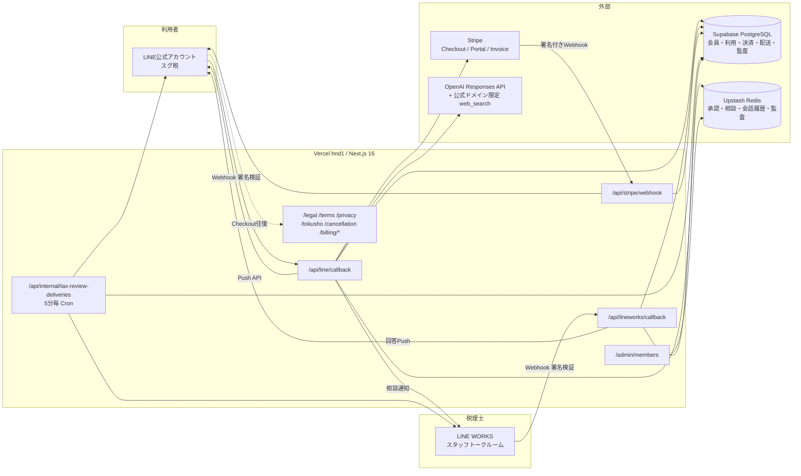
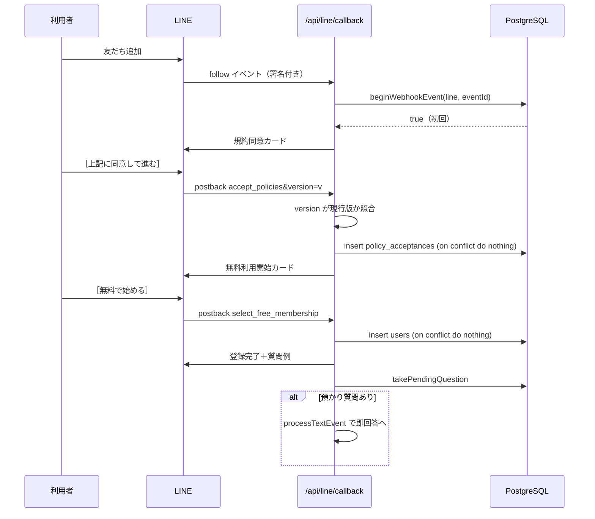
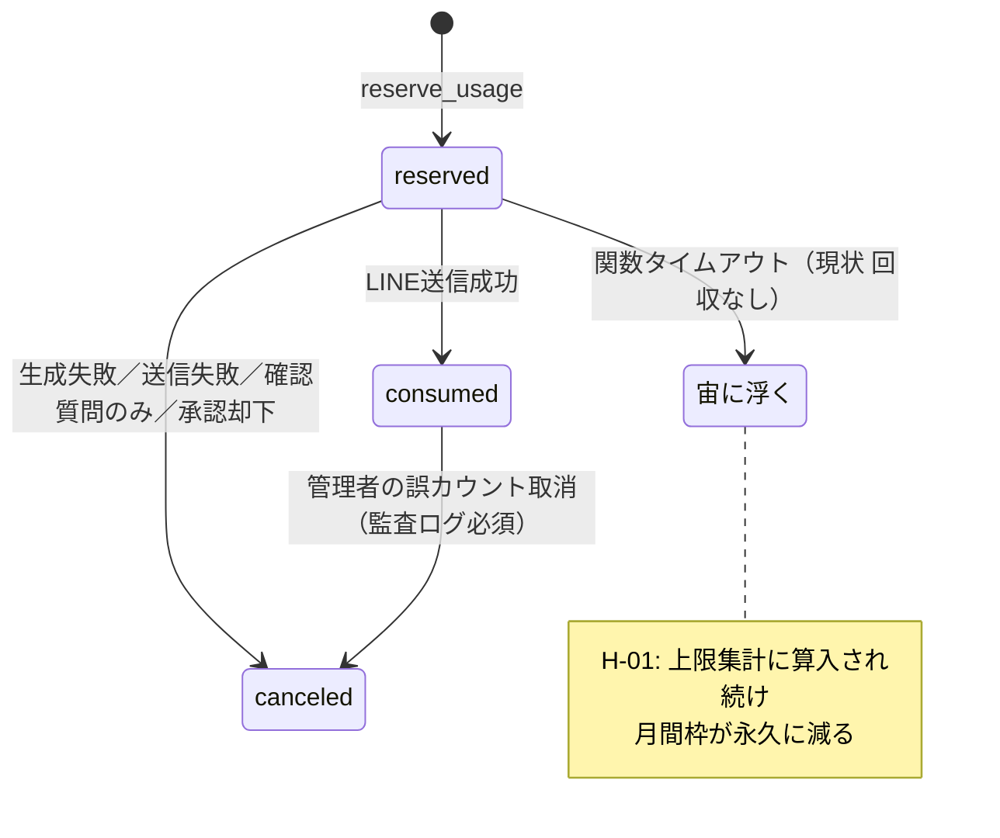
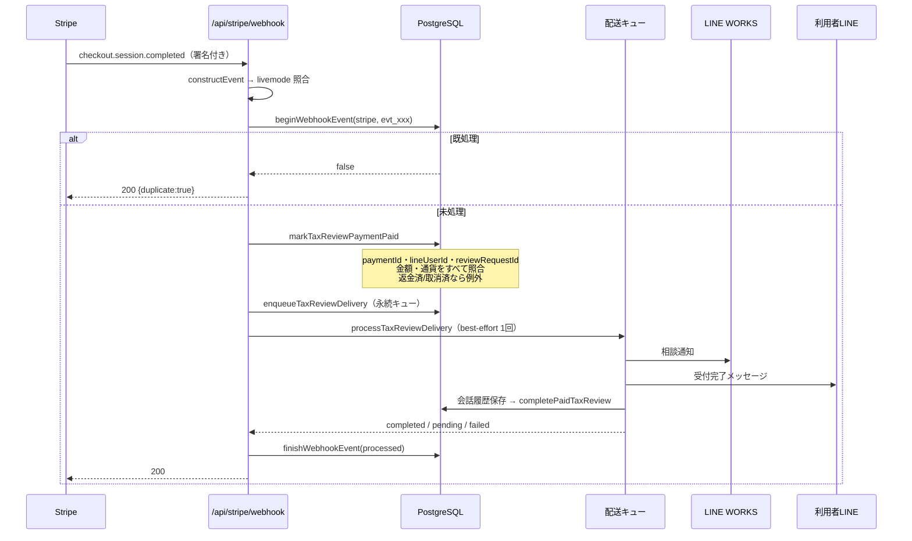

# スグ税 システムフローレビュー報告

作成日: 2026-07-31
レビュー対象: `Ryuichi-Koki/lineworks-openai-bot`（ブランチ `feat/suguzei-rich-menu` / HEAD `60195bd`）
レビュー範囲: 読み取り専用。ソースコード変更・本番データ変更・本番決済はいずれも実施していません
姉妹文書: `SUGUZEI_UI_UX_REVIEW.md`（総合評価・画面一覧・指摘事項一覧・ロードマップ）

> 指摘IDは `SUGUZEI_UI_UX_REVIEW.md` §D と共通です。
> 「【事実】」はコードで確認したもの、「【推測】」「【提案】」は判断・改善案です。

---

## 0. アーキテクチャ全体像



### データストアの責務分担【事実】

| ストア | 保持するもの | 耐久性 |
|---|---|---|
| PostgreSQL（Supabase） | `users` `plans` `usage_events` `review_requests` `tax_review_payments` `tax_review_refunds` `tax_review_delivery_jobs` `webhook_events` `policy_acceptances` `pending_questions` `tax_review_intakes` `stripe_billing_objects` `admin_audit_logs` | 永続 |
| Redis（Upstash） | 承認レコード（TTL 14日）、相談レコード、会話履歴（TTL 30日・最大20件）、顧客プロファイル、**監査記録（TTL 7年）**、修正・回答セッション | TTLあり。**監査記録の保管庫としては不適切（H-08）** |

【事実】`lib/approvals/store.ts:210-215` — Redis 未設定時は `NODE_ENV === "production"` で例外を投げる（フェイルクローズ）。メモリフォールバックは開発時のみ。

---

## 1. フロー別レビュー

### 【重要】実装が存在しないフロー

ご依頼の22フローのうち、以下は **コード上に存在しません**。

| # | フロー | 状況 |
|---|---|---|
| 2 | メール認証 | メールアドレスを一切取得しない。全DB定義にメール列なし |
| 3 | ログイン・ログアウト | 認証はLINEのuserIdのみ。セッションもトークンも無い |
| 4 | パスワード再設定 | パスワードが存在しない |
| 5 | プラン選択 | 実質的に単一プラン（無料）＋都度課金。旧「あんしん会員」の新規受付は停止 |
| 17 | プラン変更 | 変更対象のプランが存在しない |
| 20 | 退会・データ削除 | **削除処理が未実装。メール窓口の案内のみ（H-07）** |
| 21 | 管理者権限の付与・変更 | 共有Basic認証1組のみ。権限モデルが存在しない（H-04） |

以下、**実装が存在するフロー**を追跡します。

---

### F-1. 新規登録（LINE友だち追加）

| 項目 | 内容 |
|---|---|
| **開始条件** | LINE公式アカウントを友だち追加（`follow` イベント）、または未登録のままテキスト送信 |
| **主な画面** | 規約同意カード → 無料利用開始カード |
| **呼び出し** | `POST /api/line/callback` → `getFollowEvent` → `beginWebhookEvent` → `showLegalConsentPrompt`（`route.ts:1244-1266`） |
| **DBテーブル** | `webhook_events`（冪等）、`policy_acceptances`、`users`、`pending_questions` |
| **ステータス変化** | （なし）→ `policy_acceptances` 行作成 → `users.plan_code='free'` / `membership_status='free'` |
| **正常終了** | `users` に行が存在し、当月の `current_period_start/end` が設定される |
| **エラー時** | Webhook全体が500を返し `webhook_events.processing_status='failed'`。LINE再送時に `beginWebhookEvent` が `failed` を検知して**再処理を許可**（`store.ts:326`） |
| **二重実行** | `webhook_events` の `unique(provider,event_id)` と `policy_acceptances.idempotency_key` で二重記録を防止。`registerMembershipUser` は `on conflict do nothing`（`store.ts:117-127`） |
| **途中離脱** | 同意せずに離脱した場合、質問は `pending_questions` に24時間保持（`store.ts:1122-1138`）。期限切れ行は保存のたびに削除 |
| **通知** | あり（同意カード・登録完了メッセージ） |
| **監査証跡** | `policy_acceptances`（バージョン・日時・出所）に永続記録。**良好** |

**問題点**
- H-12: 各法務文書を開かずに同意ボタンを押せる。同意記録は `terms/privacy/foreign_transfer` を一括で `true` 固定（`store.ts:184-203`）
- M-10: `LEGAL_POLICY_VERSION` が未設定だと `currentPolicyVersion()` が例外（`lib/legal/config.ts:29-37`）。本番設定検査に含まれていない

**改善案**
- 同意カード本文に外国提供の要点を明示し、一覧ページに各文書の要約を追加
- `LEGAL_POLICY_VERSION` / `LEGAL_CONSENT_REQUIRED` を `check-production-config.mjs` の必須検査へ



---

### F-2. 税務質問の送信とAI回答の生成

| 項目 | 内容 |
|---|---|
| **開始条件** | 登録済み利用者がLINEへテキスト送信（定型文・相談入力中でないこと） |
| **主な画面** | 受付メッセージ → AI回答（＋根拠＋残回数＋必要なら税理士相談ボタン） |
| **呼び出し** | `processTextEvent`（`route.ts:833-1125`）→ `reserveUsage` → `generateReplyDraft`（OpenAI最大4回）→ `pushLineMessage` → `consumeUsage` |
| **DBテーブル** | `usage_events`、`users`、`webhook_events`。Redis: 会話履歴・承認レコード・監査記録 |
| **ステータス変化** | `usage_events`: `reserved` → `consumed`（送信成功）／`canceled`（失敗・確認質問のみ）<br/>承認レコード: `sending` → `sent` |
| **正常終了** | 利用者にAI回答が届き、`usage_events.status='consumed'`、会話履歴と監査記録が保存される |
| **エラー時** | ① AI生成失敗 → `cancelUsage` ＋「回数を消費していません」を通知 ＋ 例外を再スロー（`route.ts:1002-1016`）<br/>② LINE送信失敗 → `cancelUsage` ＋ 承認レコードを `pending` へ戻す（同 `1114-1118`）<br/>③ 監査記録・会話履歴の保存失敗 → **握り潰してログのみ**（回答送信は継続。設計判断として妥当） |
| **二重実行** | `usage_events.idempotency_key = "line:{eventId}:ai_answer"` が UNIQUE。`beginWebhookEvent` で同一eventIdの並行処理を抑止。`createApproval` は Redis `SET NX` |
| **途中離脱** | LINE側の会話を閉じても Push API で届くため影響なし。**ただし関数タイムアウト時に `reserved` が残る（H-01）** |
| **通知** | あり（受付メッセージ・回答・失敗通知） |
| **監査証跡** | `draft_generated` / `reply_sent` を Redis に保存（質問・回答・モデル・プロンプト版・根拠・前提）。**読む手段が無い（H-08）** |

**問題点**
- **H-01（High）**: 宙に浮いた `reserved` を回収する仕組みが無い。`reserve_usage` と `getUsageSummary` の両方が `reserved` を上限に算入するため、失敗のたびに月間枠が永久に1件減る
- **H-09（High）**: OpenAI呼出（クエリ生成→Web検索→本文生成→必要なら再生成）をWebhookハンドラ内で同期実行。`vercel.json` に `maxDuration` の指定が無い
- **H-06（High）**: 品質ゲート `shouldAutoReply()` が実装済みだが本番経路から呼ばれていない
- **M-01（Medium）**: `redactSensitiveText` はラベル付き記載のみ対応。自然文の個人情報は素通り

**AI回答の安全対策【事実・良好】**
- プロンプトインジェクション: 顧客文を `<customer_message>` 等で囲み「命令として扱わない」と明示（`generateReplyDraft.ts:632-658`）。検索クエリ生成側にも同趣旨の指示（同 `366`）
- 根拠の捏造対策: モデルが挙げたURLを、実際の `url_citation` 注釈と正規化のうえ突合し、**一致しないURLは根拠から除去**（`policy.ts:126-138`）。加えて公的ドメイン許可リストで二重に制限（同 `7-23`）
- 断定回避: 根拠ゼロなら強制的に `confidence='低'` / `requiresTaxProfessionalReview=true` とし、本文へ注意書きを追記（同 `159-167`）
- 高リスク誘導: 脱税・組織再編・税務調査等をローカル正規表現で検知しレベルCへ強制（同 `59-98`）。モデル出力に依存しない
- 情報不足の判定: `isClarificationOnly` で追加質問のみの回答を検知し、**回数を消費せずに**再生成（同 `140-147`）
- 追跡性: `model` / `promptVersion` / `generatedAt` / `sources`（URL・法令参照・引用・取得日時）/ `assumptions` を監査記録へ保存
- OpenAI への保存無効化: 全リクエストで `store: false`

```mermaid
sequenceDiagram
    participant U as 利用者
    participant A as /api/line/callback
    participant D as PostgreSQL
    participant O as OpenAI
    participant R as Redis

    U->>A: 税務質問
    A->>D: reserve_usage(ai_answer, key=line:eventId:ai_answer)
    Note over D: users 行を FOR UPDATE でロック<br/>reserved+consumed を集計
    alt 上限到達
        D-->>A: allowed=false
        A->>U: 今月の上限＋次回利用可能日
    else 予約成功
        D-->>A: allowed=true, usageEventId
        A->>U: ご質問を受け付けました
        A->>O: ①検索クエリ生成
        A->>O: ②公式ドメイン限定 web_search
        A->>O: ③本文生成（JSON Schema strict）
        opt 追加質問のみ
            A->>O: ④結論を先に置いて再生成
        end
        A->>A: verifySources / enforceDraftPolicy
        alt 確認質問のみ
            A->>D: transition_usage(canceled)
        end
        A->>R: createApproval (SET NX)
        A->>R: 監査記録 draft_generated
        A->>U: AI回答＋根拠＋残回数
        A->>D: transition_usage(consumed)
        A->>R: 監査記録 reply_sent
    end
```



---

### F-3. 利用回数のカウントと月次リセット

**【事実】カウントの実装（`migrations/001:124-238`）**

```
reserve_usage(line_user_id, usage_type, idempotency_key, ...)
  1. users を INSERT ... ON CONFLICT DO NOTHING（初回自動登録）
  2. SELECT ... FROM users WHERE line_user_id = ... FOR UPDATE  ← 排他ロック
  3. 契約期間の決定
       active/cancel_at_period_end かつ 現在日が期間内 → 契約期間を使用
       それ以外 → date_trunc('month', now() at time zone 'Asia/Tokyo') 〜 月末
  4. idempotency_key の既存レコードを確認（あれば同じ結果を返す）
  5. status in ('reserved','consumed') を集計
  6. count >= limit なら allowed=false
  7. usage_events へ 'reserved' で INSERT
```

| 論点 | 評価 |
|---|---|
| **同時リクエストで上限を超えないか** | 【良】`FOR UPDATE` によりユーザー行で直列化されるため、**構造的に超過しない**。ただし実DBに対するテストは無い（C-03） |
| **AI生成失敗時に回数を消費するか** | 【良】消費しない。`cancelUsage` で予約を取り消し、利用者にもその旨を通知（`route.ts:1003-1014`） |
| **再送信・画面更新で二重カウントされるか** | 【良】`idempotency_key` が UNIQUE。同じLINEイベントIDからは常に同じキーが生成される |
| **月の区切りとタイムゾーン** | 【良】`at time zone 'Asia/Tokyo'` を明示。JSTの月初〜月末。`freePeriod()`（`periods.ts:6-16`）も同じ定義。**リセット用のバッチは不要**（参照時に動的算出） |
| **プラン変更・解約・再契約時** | 【一部課題】契約期間が切れた `active` ユーザーを**ローカルで強制的に free へ降格**（`migrations/001:177-194`）。Stripe Webhook の到着が遅れると一時的に有料機能が使えない（M-06） |
| **管理者による調整履歴** | 【良】`cancelErroneousUsage` が `consumed` → `canceled` を行い、変更前後のJSONと理由を `admin_audit_logs` へ記録（`store.ts:1602-1632`）。理由は必須入力 |

**問題点**
- **H-01（High）**: 上記の通り、`reserved` の回収機構が無い

**改善案（E-3 と同じ）**
集計条件を `status='consumed' or (status='reserved' and created_at > now() - interval '30 minutes')` に変更し、
併せてCronで期限切れ予約を `canceled` へ回収する。これにより回収バッチの遅延に関わらず利用者は枠を失わない。



---

### F-4. 上限到達時の制御

| 項目 | 内容 |
|---|---|
| **開始条件** | `reserve_usage` が `allowed=false` を返す |
| **呼び出し** | `buildLimitMessage(reservation)`（`messages.ts:32-63`） |
| **表示内容** | 「今月の無料AI回答回数を使い切りました」＋ **次回利用可能日**（`nextAvailableDate(periodEnd)` = 翌月1日）＋ 都度課金モードでは「税理士相談はAI残数にかかわらず申込可能」 |
| **回数消費** | **しない**（予約が成立していないため） |
| **通知** | あり |

【良】上位プランへの誘導を行わず、翌月の利用可能日と税理士相談の案内に留めている。引継ぎ書の方針と一致。
【良】マイページ照会・料金照会・解約照会はいずれも回数を消費しない（`route.ts:487-517, 934-966`）。

---

### F-5. 税理士相談の依頼（決済前）

| 項目 | 内容 |
|---|---|
| **開始条件** | リッチメニュー「税理士相談」の postback、またはAI回答下の「税理士へ個別相談」ボタン |
| **主な画面** | 注意＋入力依頼 → 内容の全文再掲＋確認カード |
| **呼び出し** | `startTaxProfessionalReviewIntake` → `startTaxReviewIntake`（`route.ts:655-678`）→ 次の1通で `confirmTaxReviewIntake`（同 `680-708`） |
| **DBテーブル** | `tax_review_intakes`（受付枠・30分）、`review_requests`（`status='draft'`） |
| **ステータス変化** | `review_requests`: （なし）→ `draft` |
| **正常終了** | 相談内容が `review_requests.question_summary` に保存（マスク済み・1,200字上限）、確認カード表示 |
| **エラー時** | 受付枠が期限切れ → `takeTaxReviewIntake` が `"expired"` を返し、**AI質問として処理せず**「回数は消費していません」と案内（`store.ts:1171-1182`、`route.ts:918-931`） |
| **二重実行** | `tax_review_intakes` は `line_user_id` が主キーで `on conflict do update`。同一利用者に受付枠は常に1つ |
| **途中離脱** | 30分で受付枠が失効。「相談キャンセル」で明示的に取消可能（`route.ts:895-910`）。メニュー表示でも自動キャンセル（同 `883`） |
| **通知** | あり |
| **監査証跡** | `review_requests` に永続記録 |

【良】受付枠の期限切れを `"none"` と明確に区別している点は、**誤って回数を消費させない**ための優れた設計。
【良】相談内容を全文再掲してから確認ボタンを出す（`client.ts:398-413` のコメントに設計意図が明記されている）。

**問題点**
- M-09: 確認カードに回答時期の目安が無い

---

### F-6. Stripe決済（税理士相談・都度課金）

| 項目 | 内容 |
|---|---|
| **開始条件** | 確認カードの「この内容で依頼する」postback |
| **呼び出し** | `submitTaxProfessionalReview`（`route.ts:710-784`）→ 旧特典が無ければ `createTaxReviewCheckoutSession`（`billing.ts:155-285`） |
| **DBテーブル** | `tax_review_payments`、`review_requests` |
| **ステータス変化** | `tax_review_payments`: （なし）→ `pending`<br/>`review_requests`: `draft` → `awaiting_payment` |
| **正常終了** | Checkout URL を含む決済ボタンをLINEへ送信 |
| **エラー時** | 例外を捕捉し「ご請求は発生していません。時間をおいて、もう一度お試しください」を通知（`route.ts:738-750`） |
| **二重実行** | ① `tax_review_payments.review_request_id` が UNIQUE ② 有効期限内の既存Checkoutがあれば同じURLを再提示し「二重請求は発生しません」と明示（`billing.ts:168-175`、`route.ts:726-729`） ③ Stripe側の `idempotencyKey`（payment.id＋価格コード＋30分バケット） |
| **途中離脱** | Checkout は31分で失効（`billing.ts:204`）。`checkout.session.expired` Webhook または Cron の `markExpiredTaxReviewPayments` で `failed` へ、`review_requests` は `draft` へ戻る |
| **通知** | あり（決済ボタン・失効通知・失敗通知） |
| **監査証跡** | `tax_review_payments`、`stripe_billing_objects`、`webhook_events` |

**決済前の表示【事実・良好】**
- LINEカード: `相談1回分 X円（税込）。支払完了後に受付を開始します。都度払いで自動更新はありません。返金条件は特商法表記をご確認ください。` ＋ 特商法リンク ＋「内容を入力し直す」「支払いをやめる」（`client.ts:104-148`）
- Stripe Checkout の `custom_text.submit`: 決済完了後に受付開始、都度払い・自動更新なし、利用規約URL、特商法URL（`billing.ts:248-263`）
- Price の検証: Checkout作成前に `stripe.prices.retrieve` で `type='one_time'` / `currency` / `unit_amount` / `tax_behavior='inclusive'` を照合し、不一致なら作成しない（`billing.ts:182-193`）。**表示価格とCheckout価格の乖離を構造的に防ぐ良い設計**

**問題点**
- **C-01（Critical）**: `createOrGetTaxReviewPayment` の INSERT が `check (amount in (1000, 3000))`（`migrations/006:29`）に違反する。コードの実価格は 1,100 / 3,300（`consultationPricing.ts:1-2`）。**このフローは最初のDB書き込みで失敗する**

```
migrations/006_one_time_tax_review.sql:29
  amount integer not null check (amount in (1000, 3000)),

lib/stripe/consultationPricing.ts:1-2
  export const TAX_REVIEW_STANDARD_PRICE_JPY = 3300;
  export const TAX_REVIEW_PROMO_PRICE_JPY = 1100;
```
migration 007 は `status` 制約のみを変更しており、`amount` 制約には触れていない。
commit `a982e7a`「feat: update consultation prices」に対応するマイグレーションが存在しない。

**確認方法**
```sql
select conname, pg_get_constraintdef(oid)
from pg_constraint
where conrelid = 'tax_review_payments'::regclass;
```

**改善案**
migration 008 で当該制約を削除し、`check (amount > 0 and amount <= 100000)` 等の範囲制約へ置換する。
**価格の正しさはアプリ側（Stripe Price の実値照合）で既に担保されているため、DBのCHECK制約に価格を埋め込む必要は無い。**

---

### F-7. Webhookによる契約状態・決済状態の反映

| 項目 | 内容 |
|---|---|
| **開始条件** | Stripe から `POST /api/stripe/webhook` |
| **署名検証** | 【良】`stripe.webhooks.constructEvent` で必ず検証。失敗時400（`route.ts:24-32`） |
| **モード照合** | 【良】`assertStripeObjectMode(event.livemode)` で `STRIPE_MODE` と一致しないイベントを400で拒否（同 `33-40`）。**テスト/本番の取り違えを構造的に防ぐ** |
| **冪等性** | 【良】`beginWebhookEvent` が `webhook_events` の `unique(provider,event_id)` で重複を検知し `{received:true, duplicate:true}` を返す。`payload_hash` の不一致は例外（同一IDでの内容差し替えを検知） |
| **処理対象イベント** | `checkout.session.completed` / `async_payment_succeeded` / `async_payment_failed` / `expired` / `refund.created|updated|failed` / `customer.subscription.created|updated|deleted` / `invoice.paid|payment_failed|voided`（`webhooks.ts:307-337`） |
| **DBテーブル** | `webhook_events`、`tax_review_payments`、`tax_review_delivery_jobs`、`tax_review_refunds`、`users`、`stripe_billing_objects` |
| **エラー時** | `finishWebhookEvent(..., 'failed', message)` を記録し500を返す。**Stripe が自動再送し、`failed` 状態なら `beginWebhookEvent` が再処理を許可**（`store.ts:326`）。回復設計として正しい |
| **通知** | 契約状態が**変化したときだけ**通知（`resolveBillingNotification`。`messages.ts:203-227`）。同一状態の再受信では通知しない |
| **監査証跡** | `webhook_events`（イベントID・種別・ハッシュ・結果・日時）、`stripe_billing_objects` |

**決済成功画面だけで契約を有効化していないか【事実・良好】**
`/billing/success` は完全に静的な案内ページ（`app/billing/success/page.tsx`）。
Stripeセッションの検証もDB更新も一切行わない。契約状態の反映は Webhook のみ。**設計として正しい。**

**決済完了 → 税理士へ送付の流れ**


**問題点**
- **H-10（High）**: `enqueueTaxReviewDelivery` の `on conflict (review_request_id) do update set updated_at = now()`（`store.ts:830-832`）は **`status` をリセットしない**。`failed` / `canceled` のジョブは再投入しても復活しない。`requeueTaxReviewDeliveryJob` も `status='failed'` のみ対象（同 `1310-1320`）で `canceled` を扱わない
- **M-08（Medium）**: 失敗時に `error.message` をそのまま `webhook_events.processing_result` へ保存（`app/api/stripe/webhook/route.ts:64`）
- **L-02（Low）**: `handleInvoice` が `invoice.id` の null ガードをしていない（`webhooks.ts:286`）
- **運用（高）**: Stripe本番Webhookが上記イベントを**すべて**購読しているかは未確認（引継ぎ書の残タスク4）。`customer.subscription.*` の購読漏れがあると旧月額契約が有効化されない

**StripeとDBの不整合からの回復手段【事実・良好】**
- `enqueueMissingPaidTaxReviewDeliveries`（`store.ts:838-854`）— `status='paid'` なのに配送ジョブが無い決済を検出して自動投入
- `markExpiredTaxReviewPayments`（同 `1004-1027`）— 期限切れの `pending` を `failed` にし、`review_requests` を `draft` へ戻して利用者へ通知
- 上記2つを `reconcileTaxReviewDeliveries` が5分毎Cronで実行（`deliveryQueue.ts:128-160`）
- `scripts/replay-latest-failed-stripe-event.mjs` / `sync-stripe-webhook-events.mjs` / `reconcile-current-stripe-subscription.mjs` を用意

---

### F-8. 税理士確認依頼の配送（永続キュー）

| 項目 | 内容 |
|---|---|
| **開始条件** | 決済完了、または旧特典による受付 |
| **DBテーブル** | `tax_review_delivery_jobs` |
| **ステータス変化** | `pending` → `processing` → `completed`／`failed`／`canceled`（全額返金時） |
| **ジョブ取得** | 【良】`for update skip locked` ＋ `locked_at < now() - interval '5 minutes'` のstale回収（`store.ts:862-881`）。複数インスタンスでの二重処理を防止 |
| **ステップ冪等性** | 【良】`staff_sent_at` / `customer_sent_at` / `conversation_saved_at` を個別に記録し、再試行時は未完了ステップのみ実行（`deliveryQueue.ts:49-63`）。**LINE WORKS通知の重複送信を防ぐ** |
| **再試行** | 【良】指数バックオフ（`least(60, 2^n)` 分、最大8回。`store.ts:963-987`）。Cron 5分毎 |
| **最終失敗時** | 【良】税理士へ「要確認」通知＋利用者へ「重複してお支払いせず info@abtax.jp へ」を送信（`deliveryQueue.ts:70-90`） |
| **返金との整合** | 【良】全額返金時に配送ジョブを `canceled` にする（`store.ts:1094-1103`）。配送処理側でも `paymentStatus` が `canceled`/`refunded` なら中断（`deliveryQueue.ts:38-42`） |
| **監査証跡** | ジョブの試行回数・最終エラー・各ステップ日時を永続記録。**良好** |

**問題点**
- **C-02（Critical）**: 税理士へ渡る本文の組み立てに欠陥

```
lib/tax/consultationService.ts:40-52
  const recentContext = conversationHistory
    .slice(-6)                                    // 直近6件（古い→新しい）
    .map(...)
    .join("\n\n");
  staffContext: [
    `LINE利用者: <ハッシュ>`,
    "",
    redactSensitiveText(recentContext || input.customerText).slice(0, 1600),
                                                  //  ^^^^ 先頭から1,600字
  ].join("\n")
```
会話履歴は RPUSH（古い順）で保存される（`approvals/store.ts:310-311`）。
`.slice(-6)` は正しく直近6件を取るが、その後の `.slice(0, 1600)` は**連結文字列の先頭**を残す。
AI回答は数千字になりうるため、**支払対象の相談内容（末尾）が丸ごと切り落とされる**。
さらに `lineworks/client.ts:115` の `truncate(..., 1000)` で再度短縮される。

また、会話履歴が空の場合のみ `input.customerText`（支払われた相談本文）が使われる（`||` の右辺）。
**AIを1往復でも使った利用者では、税理士は相談本文を読めない可能性が高い。**

**改善案**
```
staffContext = [
  `受付ID / 受付日時 / 支払金額 / 回答期限`,
  "",
  "【相談内容（お支払い対象）】",
  redactSensitiveText(input.customerText),        // 全文を先頭に固定
  "",
  "【直近のAIとのやり取り（参考）】",
  redactSensitiveText(recentContext).slice(0, 残り字数),
].join("\n")
```
併せて `handoffSummary`（`generateReplyDraft.ts:40-49` で既に生成済みだが未活用）を添付すると、
税理士は論点・前提・確認事項を即座に把握できる。

- **H-05（High）**: 通知に優先度・期限・担当者・受付日時・支払金額が無く、未回答一覧も存在しない

---

### F-9. 税理士による確認・回答とユーザーへの通知

| 項目 | 内容 |
|---|---|
| **開始条件** | LINE WORKS で「この相談に回答」を押下 |
| **呼び出し** | `POST /api/lineworks/callback` → `handleConsultationReplyStart` → `handleConsultationReplyText` → `handleConsultationSend`（`callback/route.ts:395-579`） |
| **ストア** | Redis（相談レコード・回答セッション） |
| **ステータス変化** | `waiting_reply` → `drafting` → `awaiting_send` → `sending` → `sent` |
| **認証** | 【一部課題】LINE WORKS署名検証（HMAC-SHA256＋`timingSafeEqual`）＋ `isAuthorizedApprover` |
| **誤送信防止** | 【良】2段階確認。回答文入力時点では送信せず、全文を再掲したうえで「公式LINEへ送信」を押して初めて送信（同 `443-451`）。回答は1,800字上限 |
| **同時編集** | 【良】`transitionConsultation(id, from, to, ...)` が遷移元を指定するため、2人目は `already_processed` を受け取る。セッションは `(channelId, reviewerUserId)` 単位で1件のみ（`handleConsultationReplyStart:404-413`） |
| **AI下書きとの区別** | 【良】税理士回答は `👤 Apex Brain税理士法人からの回答` ヘッダ＋フッター、AI承認回答は `※AIが作成し、当法人の担当者が確認のうえ送信した回答です` |
| **エラー時** | LINE送信失敗なら `sending` → `awaiting_send` へ戻して例外を再スロー（同 `570-578`）。回答は失われない |
| **通知** | あり（利用者へ回答、税理士へ送信完了） |
| **監査証跡** | `reply_sent` を Redis へ記録（回答本文・操作者ハッシュ・日時）。**読む手段が無い（H-08）** |

**問題点**
- **H-02（High）**: `isAuthorizedApprover` は `LINEWORKS_APPROVER_USER_IDS` 未設定時に**無条件 `true`**（`callback/route.ts:141-149`）。フェイルオープン。`check-production-config.mjs` の検査対象外
- **H-05（High）**: 未回答一覧が無い
- **M-12（Medium）**: 送信後の訂正・撤回手段が無い
- **L-04（Low）**: ボタンが `type:"message"` のためラベル文言が税理士の発言としてトークに残り、相談本文が流れやすい

---

### F-10. AI下書きの承認フロー（`LINE_HYBRID_AUTO_REPLY_ENABLED=false` 時のみ）

| 項目 | 内容 |
|---|---|
| **ステータス変化** | `pending` → `sending` → `sent`／`rejected`／`revision_requested` → `revising` → `pending` |
| **リビジョン管理** | 【良】postback に `revision` を含め、`isCurrentRevision` で古いボタンからの操作を `stale_revision` として拒否（`callback/route.ts:136-139`）。**流れたトークの古いボタンによる誤操作を防ぐ** |
| **却下時** | `cancelUsage` で利用回数を戻す（同 `229-231`） |
| **修正時** | `reviseReplyDraft` で再生成し、失敗時は `revision_requested` へ戻して同じ指示の再送を促す（同 `376-392`） |
| **排他** | 承認セッションと相談回答セッションの同時保持を相互に拒否（同 `251-258, 398-403`） |

【事実】**既定では `hybridAutoReplyEnabled()` が true のため、このフローは通常動作しない**（`route.ts:179-181`）。
実装は堅牢だが、H-06 を採用しない限り死蔵状態です。

---

### F-11. 決済失敗・カード期限切れ（旧月額契約）

| 項目 | 内容 |
|---|---|
| **開始条件** | Stripe `invoice.payment_failed` |
| **呼び出し** | `handleInvoice` → `markStripePaymentFailed`（`webhooks.ts:297-300`、`store.ts:1457-1491`） |
| **ステータス変化** | `users.membership_status='past_due'`、`payment_failed_at` を設定 |
| **利用可否への影響** | 【課題】`reserve_usage` は `past_due` を「契約期間内」と見なさないため（`migrations/001:168`）、期間内であっても月初〜月末の無料枠へフォールバックする。都度課金モードでは実質的な差は無いが、旧契約者の権利保護としては曖昧 |
| **通知** | 【良】`payment_failed` 通知で原因（有効期限切れ・限度額超過）と対処（契約管理画面）を案内（`messages.ts:295-306`） |
| **カード更新後** | `invoice.paid` → `projectStripeSubscription` → `active` に戻り `payment_recovered` を通知。`payment_failed_at` は `syncStripeMembership` で null にリセット（`store.ts:1444-1447`）。**回復フローは正しく動く** |
| **監査証跡** | `stripe_billing_objects`、`webhook_events` |

---

### F-12. 解約（旧月額契約）

| 項目 | 内容 |
|---|---|
| **開始条件** | リッチメニュー「利用状況・退会」、または「退会したい」等のテキスト |
| **呼び出し** | `showBillingManagement(userId, 'cancel')`（`route.ts:418-466`）→ `createCustomerPortalSession` with `flow_data.subscription_cancel` |
| **ステータス変化** | Stripe Portal で解約 → `customer.subscription.updated` → `cancel_at_period_end` → 期間終了後 `canceled` |
| **都度課金モード時** | 【良】解約対象の契約が無いことを明示し、領収書と支払方法変更のみを提示（同 `431-440`） |
| **URL安全性** | 【良】`assertSafeStripePortalUrl` が `https` かつ `*.stripe.com` のみを許可（`billing.ts:382-394`） |
| **解約時期・次回請求日の提示** | 【良】`cancellation_scheduled` 通知で「有料機能の利用期限」「無料会員へ切り替わる日」「追加請求なし」を明示（`messages.ts:264-278`） |
| **通知** | あり |
| **監査証跡** | `webhook_events`、`stripe_billing_objects` |

---

### F-13. 退会・データ削除

**【事実】実装が存在しません。**

| 論点 | 状況 |
|---|---|
| 削除処理 | `users` の削除・論理削除・仮名化のいずれも未実装 |
| FK制約 | `review_requests.user_id` / `usage_events.user_id` / `tax_review_payments.user_id` がすべて `on delete restrict`（`migrations/001:52,68`、`006:24`）。**`users` の物理削除はDB制約で拒否される** |
| Redis | 会話履歴・相談記録・監査記録の削除関数が無い |
| Stripe | 顧客の匿名化・削除の手順が無い |
| LINE WORKS | 税理士トークルームに相談本文が残り続ける |
| 案内 | `app/cancellation/page.tsx` と `managementMessages.ts:33` がメール窓口（info@abtax.jp）を案内 |

**規約との不整合（H-07）**
- プライバシーポリシー10章: 「保存の必要がなくなった情報は復元困難な方法により削除又は廃棄します」（`lib/legal/documents.ts:396`）
- 同11章: 開示・訂正・**削除・利用停止・消去**の請求権を明記（同 `403`）
- **しかし請求に応じるためのシステム的手段が無い。** 現状は手作業で複数ストアを横断する必要があり、実務上の実行可能性が低い

**改善案**
1. 保存期間を規約に具体的年数で明記（§G Q5）
2. 削除の実態を「仮名化＋論理削除」として定義（税務上の記録保存義務と両立させる）
3. `users.deleted_at` の追加、会話履歴の即時削除、Stripe顧客の匿名化、`display_name` の消去を実装
4. 削除実行を管理画面の操作とし、`admin_audit_logs` に記録

---

### F-14. 利用規約等への同意記録

| 項目 | 内容 |
|---|---|
| **DBテーブル** | `policy_acceptances`（`migrations/004`） |
| **保存内容** | `line_user_id`、`policy_version`、`terms_accepted`、`privacy_accepted`、`foreign_transfer_accepted`、`source`、`idempotency_key`、`accepted_at` |
| **冪等性** | 【良】`idempotency_key` UNIQUE ＋ `(line_user_id, policy_version)` UNIQUE |
| **バージョン管理** | 【良】`LEGAL_POLICY_VERSION` と postback の `version` を照合し、不一致なら同意カードを再提示（`route.ts:1274-1277`）。改定時に再同意を取れる |
| **改定履歴** | 【良】文書側に `enactedOn` / `revisedOn` を保持し画面に表示 |
| **問題点** | H-12: 3項目が常に `true` 固定で、各文書を開いた形跡は記録されない |

---

## 2. エッジケース検証

| # | エッジケース | 現状の挙動【事実】 | 評価 | 対応 |
|---|---|---|---|---|
| 1 | **決済成功したがWebhook処理に失敗** | `finishWebhookEvent(failed)` を記録し500。Stripeが再送 → `beginWebhookEvent` が `failed` を検知して再処理を許可（`store.ts:326`）。さらにCronの `enqueueMissingPaidTaxReviewDeliveries` が `paid` かつ配送ジョブ無しの決済を自動救済 | **良好（二重の回復手段）** | — |
| 2 | **Webhookが複数回届いた** | `webhook_events` の `unique(provider,event_id)` で即 `{duplicate:true}` を返す。`payload_hash` 不一致時は例外（同一IDでの内容差し替え検知）。通知も `resolveBillingNotification` が状態変化時のみ発火 | **良好** | — |
| 3 | **AI回答生成中に画面を閉じた** | Push APIで送信するため影響なし。回答は後から届く | **良好** | — |
| 4 | **送信ボタンを連打した** | ① `usage_events.idempotency_key` UNIQUE ② `beginWebhookEvent` で同一eventIdを抑止 ③ Checkout は `tax_review_payments.review_request_id` UNIQUE ＋ Stripe `idempotencyKey` ＋ 有効期限内のURL再利用 ④ LINE `X-Line-Retry-Key` | **良好（4層）** | — |
| 5 | **残り1回で同時に2件送信** | `reserve_usage` が `select ... for update` でユーザー行をロック。2件目は `allowed=false` | **設計は正しい。実DBでの検証が無い** | C-03 |
| 6 | **AI生成は失敗したが回数だけ減った** | `catch` で `cancelUsage` を実行し、利用者へ「回数を消費していません」と通知（`route.ts:1003-1014`） | **良好** | — |
| 6b | **関数タイムアウトで予約が残った** | **回収されない。上限集計に算入され続ける** | **未対応** | **H-01** |
| 7 | **税理士確認中にユーザーが解約** | 都度課金では解約の概念が無い。旧契約者は期間末解約のため相談は継続。`review_requests` は影響を受けない | 良好 | — |
| 8 | **回答前にユーザーが退会** | **退会処理自体が存在しない**（F-13） | **未対応** | H-07 |
| 9 | **管理者が同じ相談を同時編集** | `transitionConsultation` の遷移元指定で2人目は `already_processed`。セッションも `(channelId, reviewerUserId)` で1件のみ | **良好** | — |
| 10 | **税理士回答の送信後に修正したい** | 手段が無い | **未対応** | M-12 |
| 11 | **決済失敗後にカード情報を更新** | `invoice.paid` → `projectStripeSubscription` → `active` ＋ `payment_recovered` 通知。`payment_failed_at` もリセット | **良好** | — |
| 12 | **プラン変更と月次リセットが同時期に発生** | `reserve_usage` は契約期間内なら契約期間、それ以外はJST暦月を使用。期間切れの `active` は**ローカルで強制的にfreeへ降格**するため、Webhook遅延時に一時的な不整合 | 課題 | M-06 |
| 13 | **セッション切れの状態で質問を送信** | セッションの概念が無い（LINE userIdが恒久的な識別子）。規約バージョン改定時は同意カードを再提示し、質問は `pending_questions` に預かる | **良好** | — |
| 14 | **APIを画面外から直接呼び出した** | `/api/line/callback` … LINE署名検証（HMAC）／`/api/lineworks/callback` … LINE WORKS署名検証／`/api/stripe/webhook` … Stripe署名＋livemode照合／`/api/internal/tax-review-deliveries` … `CRON_SECRET` のBearer照合（`timingSafeEqual`）／`/admin/members` … Basic認証＋CSRF＋Origin検証。**すべてのエンドポイントに認証がある** | **良好** | H-02（承認者リストのフェイルオープンのみ） |
| 15 | **他人のLINE userIdを指定して相談を操作** | `cancelReviewRequest` / `submitReviewRequest` / `createOrGetTaxReviewPayment` などすべてのクエリが `u.line_user_id = ${input.lineUserId}` を結合条件に含む。userIdはLINE署名検証済みのWebhookペイロード由来で、利用者が偽装できない | **良好** | — |
| 16 | **Checkout の `reference_id` を改ざんして他人の決済を成立させる** | `markTaxReviewPaymentPaid` が paymentId・lineUserId・reviewRequestId・金額・通貨を**すべてDBの実値と照合**し、不一致なら例外（`store.ts:660-680`）。返金済・取消済も拒否 | **良好** | — |
| 17 | **全額返金後に配送が走る** | 返金記録時に配送ジョブを `canceled` にし（`store.ts:1094-1103`）、配送処理側でも `paymentStatus` を確認して中断 | **良好** | — |
| 18 | **返金取消・再開後にジョブを復活させたい** | `enqueueTaxReviewDelivery` の `on conflict` が `status` をリセットしない。`requeueTaxReviewDeliveryJob` は `failed` のみ対象 | **未対応** | **H-10** |
| 19 | **受付時間（30分）超過後に相談文を送信** | `takeTaxReviewIntake` が `"expired"` を返し、AI質問として処理せず「回数は消費していません」と案内 | **良好** | — |
| 20 | **プロンプトインジェクション（「これまでの指示を無視して…」）** | 顧客文をタグで囲み「命令として扱わない」と明示。検索クエリ生成側にも同趣旨の指示。出力はJSON Schema strict で構造を固定。根拠URLは実際の引用注釈と突合 | **良好** | — |
| 21 | **AIが存在しない条文・通達を生成** | `verifySources` が引用注釈に無いURLを除去。根拠ゼロなら強制的に低信頼＋税理士確認要＋本文へ注意書き | **良好** | — |
| 22 | **利用者が自然文で氏名・住所を書いた** | `redactSensitiveText` はラベル付き記載のみ対応。自然文は素通りでOpenAIへ送信 | 課題 | M-01 |

---

## 3. テスト状況

### 3-1. 現在存在するテスト【事実】

`node --test --experimental-strip-types tests/*.test.ts` で **125件**。

| ファイル | 件数 | 対象 |
|---|---|---|
| `membership-ledger.test.ts` | 22 | 利用回数の予約・消費・上限・同時実行・期間計算（**`MemoryMembershipLedger` に対して**） |
| `webhook-regression.test.ts` | 20 | 署名検証、承認状態遷移、会話・監査保持、LINEメッセージ分割、各種カードの文言 |
| `hybrid-service.test.ts` | 17 | 料金文言、AI/税理士回答の目印、料金・解約の意図判定 |
| `billing-notifications.test.ts` | 13 | 契約状態変化の通知種別とマイページ文言 |
| `policy.test.ts` | 11 | 脱税判定、レベルC強制、根拠検証、公式ドメイン |
| `stripe-billing.test.ts` | 10 | モード照合、Checkoutパラメータ、冪等キー、Portal URL検証 |
| `management-messages.test.ts` | 8 | 領収書一覧・支払方法・契約管理の文言 |
| `rich-menu.test.ts` | 6 | リッチメニューのサイズ・領域・postback重複 |
| `legal-documents.test.ts` | 4 | 法務文書の料金・改定日・委託先 |
| `billing-status-content.test.ts` | 4 | 決済往復ページの文言 |
| `consultation-pricing.test.ts` | 3 | 価格の期間境界（2026-12-31 / 2027-01-01 JST） |
| `production-hardening.test.ts` | 3 | セキュリティヘッダー、返金通知 |
| `line-allowlist.test.ts` | 2 | 許可リスト |
| `membership-messages.test.ts` | 2 | 期間表示 |

**品質面の評価**: 文言・境界値・状態遷移の網羅性は高く、日本語のテスト名も読みやすい。単体テストとしては良質です。

### 3-2. テストされていない重要機能【事実】

| 領域 | 状況 |
|---|---|
| **PostgreSQL全般** | `reserve_usage` / `transition_usage` の**PL/pgSQLを一度も実行していない**。同時実行テストは `MemoryMembershipLedger`（`tests/membership-ledger.test.ts:3`）に対するもので、`FOR UPDATE` の挙動は未検証 |
| **DB制約** | `tax_review_payments` への INSERT を一度も行っていない。**C-01 がすり抜けた直接原因** |
| **HTTPルート** | `app/api/*/route.ts` の `POST` / `GET` ハンドラを一度も呼んでいない |
| **Stripe Webhook** | `processStripeEvent` を実イベントで実行していない |
| **配送キュー** | `processTaxReviewDelivery` / `reconcileTaxReviewDeliveries` が未テスト |
| **管理画面** | 認証・CSRF・HTMLエスケープ・N+1 が未テスト |
| **OpenAI連携** | `generateReplyDraft` の実呼出、JSONスキーマ違反時の挙動が未テスト |
| **E2E** | LINE実機を含む一連の流れが未自動化 |

`grep -rl "DATABASE_URL\|postgres" tests/` の結果は1件のみで、実接続はありません。

### 3-3. 追加すべきテスト

#### 単体テスト（優先度: 中）
| 対象 | 検証内容 |
|---|---|
| `consultationService.prepareTaxProfessionalReview` | **相談本文が `staffContext` の先頭に全文含まれること**（C-02の回帰防止） |
| `redactSensitiveText` | 自然文の氏名・住所に対する現在の挙動を明文化（M-01の可視化） |
| `isAuthorizedApprover` | 環境変数未設定時に `false` を返すこと（H-02の回帰防止） |
| `splitLineMessages` | 5通を超える超長文の切り捨て挙動 |
| `escapeHtml` / `maskUserId` | 管理画面のXSS・マスク（H-03の回帰防止） |

#### 結合テスト（優先度: **最高**）
テスト用Postgres（Docker または Supabase のテストプロジェクト）に migration 001〜008 を適用して実行。
`scripts/setup-local-postgres.mjs` / `apply-local-migrations.mjs` / `apply-supabase-test-migrations.mjs` が既に存在するため、基盤は整っています。

| # | シナリオ | 検証内容 |
|---|---|---|
| I-1 | **決済レコード作成** | `createOrGetTaxReviewPayment` が 1,100円・3,300円の両方で成功すること（**C-01を必ず検出する**） |
| I-2 | **利用回数の同時実行** | `Promise.all` で `reserve_usage` を20並列実行し、残1回のとき成功が**厳密に1件**であること |
| I-3 | **予約の回収** | 30分以上前の `reserved` が上限集計から除外されること（H-01対応後） |
| I-4 | **月次リセット** | JSTの月またぎ（`p_now` を注入）で `billing_period_start/end` が切り替わること |
| I-5 | **Webhook冪等性** | 同一 `event_id` を2回処理して副作用が1回だけであること。`payload_hash` 不一致で例外になること |
| I-6 | **決済〜配送〜完了** | `markTaxReviewPaymentPaid` → `enqueueTaxReviewDelivery` → `processTaxReviewDelivery` → `completePaidTaxReview` の一連で状態が `pending→paid→consumed`、`review_requests` が `awaiting_payment→submitted` になること |
| I-7 | **配送失敗と再試行** | LINE WORKS送信をモックで失敗させ、`attempt_count` 増加・バックオフ・8回で `failed`・管理画面から `requeue` で復活すること（**H-10を検出する**） |
| I-8 | **返金** | 全額返金で `refunded`＋配送ジョブ `canceled`、一部返金で `partially_refunded` になること |
| I-9 | **他人のデータ分離** | 別 `line_user_id` の `reviewRequestId` を指定した `submitReviewRequest` / `cancelTaxReviewPayment` が失敗すること |
| I-10 | **Checkout期限切れ復旧** | `markExpiredTaxReviewPayments` が `failed`＋`review_requests` を `draft` へ戻すこと |

#### E2Eテスト（優先度: 高）
| # | シナリオ | 手段 |
|---|---|---|
| E-1 | 友だち追加 → 同意 → 無料登録 → AI回答 → 残回数表示 | LINE実機（テストアカウント） |
| E-2 | 税理士相談 → 内容確認 → **Stripeテストカードで決済** → 受付完了 → LINE WORKS通知 → 回答 → 利用者へ配送 | LINE実機＋Stripeテストモード |
| E-3 | 決済ボタン連打（同一相談で二重請求が起きないこと） | LINE実機 |
| E-4 | 決済中断 → 31分後の失効通知 → 再依頼 | LINE実機＋Cron |
| E-5 | Stripeダッシュボードからの返金 → 利用者への返金通知 | Stripeテストモード |
| E-6 | 無料枠100件到達 → 上限メッセージ → 翌月リセット | DB直接操作で期間を進める |
| E-7 | リッチメニュー6アクションの実機確認 | LINE実機（`PRE_PRODUCTION_CHECKLIST.md` の未了項目） |

### 3-4. Stripe Webhookのテスト方法

**既存の資産【事実】**
- `scripts/setup-stripe-sandbox.mjs` / `setup-stripe-tax-review-sandbox.mjs` — サンドボックスに商品・価格を作成
- `scripts/test-tax-review-checkout-sandbox.mjs` — Checkout作成と金額（1,100円）の検証
- `scripts/stripe-listener-local.mjs` — ローカルへのイベント転送
- `scripts/sync-stripe-webhook-events.mjs` — 購読イベントの同期
- `scripts/replay-latest-failed-stripe-event.mjs` — 失敗イベントの再送

**推奨する追加**
1. **署名生成による単体テスト**: `stripe.webhooks.generateTestHeaderString` を使い、`POST /api/stripe/webhook` を fetch で直接叩く（Stripeへの通信不要・CIで実行可能）
2. **重複配信テスト**: 同一 `event.id` で2回POSTし、2回目が `{duplicate:true}` を返すこと
3. **livemodeミスマッチ**: `livemode:true` のイベントを `STRIPE_MODE=test` へ送り400になること
4. **署名不正**: 改ざんしたボディで400になること
5. **購読イベントの網羅チェック**: `stripe.webhookEndpoints.retrieve` で `enabled_events` を取得し、必要な10種がすべて含まれることをCIで検査

### 3-5. 権限・RLSのテスト方法

【事実】本アプリは Supabase の anon key / PostgREST を使わず、`postgres` パッケージによる**サーバー専用接続**のみです。
全テーブルで `enable row level security` を実行し、**ブラウザ向けpolicyを意図的に作成していません**（各migrationのコメントに明記）。
したがってブラウザからDBへ直接アクセスする経路は存在せず、この構成は妥当です。

**推奨する検証**
1. **接続ロールの確認**: 本番の `DATABASE_URL` が使うロールを確認し、`select rolbypassrls from pg_roles where rolname = current_user;` で意図した権限であることを記録
2. **anon keyの不使用確認**: `grep -rn "NEXT_PUBLIC_\|SUPABASE_ANON" .` が0件であることをCIで常時検査（**現状0件**）
3. **アプリ層の権限テスト**: I-9（他人の `reviewRequestId` を操作できないこと）
4. **管理画面**: 認証なし401、CSRF不正403、不正Origin 403、正常系200 をHTTPテストで検証
5. **Cronエンドポイント**: `CRON_SECRET` なし401、誤ったBearer 401、正常系200

### 3-6. 利用回数の競合テスト（具体案）

```ts
// tests/integration/usage-concurrency.test.ts（新規・要テスト用DB）
test("残り1回のとき20並列で予約しても成功は1件だけ", async () => {
  const userId = `U_test_${randomUUID()}`;
  await sql`select reserve_usage(${userId}, 'ai_answer', 'warmup')`;
  // free の ai_limit を一時的に 2 にするか、99件を consumed で投入して残1にする
  await seedConsumedUsage(userId, "ai_answer", 99);

  const results = await Promise.all(
    Array.from({ length: 20 }, (_, i) =>
      sql`select * from reserve_usage(${userId}, 'ai_answer', ${`c-${i}`})`,
    ),
  );
  const allowed = results.filter((r) => r[0].allowed === true);
  assert.equal(allowed.length, 1);           // 上限超過が起きないこと
  const rows = await sql`
    select count(*)::int as n from usage_events
    where user_id = (select id from users where line_user_id = ${userId})
      and status in ('reserved','consumed')`;
  assert.equal(rows[0].n, 100);              // 合計が上限と一致すること
});
```

同様に、`tax_review` について「同一 `reviewRequestId` で `submitReviewRequest` を並列実行しても
`usage_events` が1件だけ」を検証してください。

### 3-7. リリース前に最低限実施すべきテスト一覧

| # | 種別 | 内容 | 合格条件 |
|---|---|---|---|
| 1 | 結合 | I-1 決済レコード作成（1,100 / 3,300） | 両方成功。**C-01の解消確認** |
| 2 | 結合 | I-2 利用回数の同時実行 | 成功が厳密に1件 |
| 3 | 結合 | I-6 決済〜配送〜完了 | 状態が期待どおり遷移 |
| 4 | 結合 | I-7 配送失敗と再試行・requeue | 復活すること（**H-10の解消確認**） |
| 5 | 結合 | I-8 返金（全額・一部） | 状態と通知が正しい |
| 6 | 結合 | I-9 他人のデータ分離 | すべて失敗 |
| 7 | 単体 | `staffContext` に相談本文が全文含まれる | **C-02の解消確認** |
| 8 | 単体 | 承認者リスト未設定で `false` | **H-02の解消確認** |
| 9 | HTTP | Stripe Webhook 署名検証・重複・livemode | 400/duplicate/400 |
| 10 | HTTP | 各エンドポイントの認証（無認証で401/403） | すべて拒否 |
| 11 | 設定 | `check-production-config.mjs` を本番環境変数で実行 | 全PASS |
| 12 | 設定 | Stripe本番Webhookの `enabled_events` に必要10種 | すべて含まれる |
| 13 | E2E | E-2 テストモードでの決済〜回答配送 | 完走 |
| 14 | E2E | E-3 決済ボタン連打 | 決済は1件のみ |
| 15 | E2E | E-7 リッチメニュー6アクション実機確認 | すべて反応 |
| 16 | 既存 | `pnpm test` / `pnpm typecheck` / `pnpm lint` | すべてPASS |

---

## 4. フロー横断の要約表

| # | フロー | 実装 | 冪等性 | 監査証跡 | 通知 | 主要な指摘 |
|---|---|---|---|---|---|---|
| 1 | 新規登録 | ○ | ◎ | ◎ | ○ | H-12 |
| 2 | メール認証 | **×** | — | — | — | 未実装 |
| 3 | ログイン・ログアウト | **×** | — | — | — | 未実装 |
| 4 | パスワード再設定 | **×** | — | — | — | 未実装 |
| 5 | プラン選択 | △ | ○ | ○ | ○ | 実質単一プラン |
| 6 | Stripe決済 | ○ | ◎ | ◎ | ○ | **C-01** |
| 7 | Webhookによる反映 | ◎ | ◎ | ◎ | ◎ | H-10 / 購読確認 |
| 8 | 税務質問の送信 | ○ | ◎ | ○ | ○ | H-11 |
| 9 | AI回答の生成 | ◎ | ○ | ○ | ○ | H-06 / H-09 / M-01 |
| 10 | 利用回数のカウント | ○ | ◎ | ◎ | — | **H-01** |
| 11 | 月次リセット | ◎ | — | — | — | 動的算出。良好 |
| 12 | 上限到達時の制御 | ◎ | — | — | ○ | — |
| 13 | AI生成失敗時 | ◎ | ○ | ○ | ○ | — |
| 14 | 税理士確認依頼 | ○ | ◎ | ◎ | ○ | **C-02** |
| 15 | 税理士による確認・回答 | ○ | ○ | △ | ○ | **H-02** / H-05 / M-12 |
| 16 | ユーザーへの回答通知 | ○ | ○ | △ | ○ | M-09 |
| 17 | プラン変更 | **×** | — | — | — | 未実装 |
| 18 | 決済失敗・カード期限切れ | ○ | ◎ | ○ | ◎ | M-06 |
| 19 | 解約 | ○ | ◎ | ○ | ◎ | — |
| 20 | 退会・データ削除 | **×** | — | — | — | **H-07** |
| 21 | 管理者権限の付与・変更 | **×** | — | △ | — | **H-04** |
| 22 | 規約等への同意記録 | ◎ | ◎ | ◎ | ○ | H-12 |

凡例: ◎ 優れている ／ ○ 妥当 ／ △ 不十分 ／ × 未実装

---

## 5. 環境変数一覧（変数名と用途のみ。値は一切記載しません）

| 変数名 | 用途 | 本番検査 |
|---|---|---|
| `DATABASE_URL` / `DATABASE_SSL_MODE` | PostgreSQL接続 | ○ |
| `MEMBERSHIP_BILLING_ENABLED` | 会員台帳機能の有効化 | ○ |
| `STRIPE_BILLING_ENABLED` / `STRIPE_MODE` / `STRIPE_LIVE_MODE_ENABLED` | Stripe有効化とモード | ○ |
| `STRIPE_SECRET_KEY` / `STRIPE_WEBHOOK_SECRET` | Stripe認証（Sensitive） | ○ |
| `STRIPE_PRICE_ANSHIN` / `STRIPE_PRICE_PREMIUM` | 旧月額プランのPrice ID | — |
| `STRIPE_PRICE_TAX_REVIEW_PROMO` / `_STANDARD` | 都度課金のPrice ID | ○ |
| `STRIPE_APP_BASE_URL` / `LEGAL_APP_BASE_URL` | 各種URL生成 | ○ |
| `STRIPE_PORTAL_CONFIGURATION_ID` | Customer Portal設定 | — |
| `STRIPE_SAVE_PAYMENT_METHOD_ENABLED` | カード保存の可否 | — |
| `STRIPE_INVOICE_ISSUANCE_ENABLED` / `_REGISTRATION_NUMBER` | 適格請求書の発行 | — |
| `ONE_TIME_CONSULTATION_BILLING_ENABLED` | 都度課金モード | ○ |
| `LINE_CHANNEL_SECRET` / `LINE_CHANNEL_ACCESS_TOKEN` | LINE認証（Sensitive） | ○ |
| `LINE_ALLOWED_USER_IDS` | 利用者許可リスト（空＝全員） | — |
| `LINE_HYBRID_AUTO_REPLY_ENABLED` | AI自動返信の可否 | **未検査（M-10）** |
| `LINE_API_BASE_URL` | ローカルテスト専用の差し替え | — |
| `LINEWORKS_CLIENT_ID` / `_SECRET` / `_SERVICE_ACCOUNT` / `_PRIVATE_KEY` | LINE WORKS認証（Sensitive） | ○ |
| `LINEWORKS_BOT_ID` / `_BOT_SECRET` / `_STAFF_CHANNEL_ID` | LINE WORKS Bot | ○（一部） |
| `LINEWORKS_APPROVER_USER_IDS` | 承認者の制限 | **未検査（H-02 / M-10）** |
| `UPSTASH_REDIS_REST_URL` / `_TOKEN` | Redis接続（Sensitive） | ○ |
| `OPENAI_API_KEY` | OpenAI認証（Sensitive） | ○ |
| `OPENAI_MODEL` / `OPENAI_TAX_SEARCH_MODEL` | 使用モデル | — |
| `TAX_WEB_SEARCH_ENABLED` / `TAX_EVAL_TRACE` | 検索・トレース制御 | — |
| `LEGAL_CONSENT_REQUIRED` / `LEGAL_POLICY_VERSION` | 同意導線と規約版 | **未検査（M-10）** |
| `CRON_SECRET` | Cronエンドポイント認証 | ○ |
| `ADMIN_DASHBOARD_USER` / `_PASSWORD` / `ADMIN_SESSION_SECRET` | 管理画面認証（Sensitive） | ○（設定時のみ） |
| `CONVERSATION_HISTORY_MAX_MESSAGES` / `_TTL_SECONDS` / `APPROVAL_TTL_SECONDS` | Redis保持設定 | — |

【良】`NEXT_PUBLIC_` 接頭辞の環境変数は**1件も存在しません**。秘密情報のクライアント露出はありません。

---

## 6. 結論

**本番公開（実課金開始）は現時点では No-Go です。**

技術的な基盤（署名検証・冪等性・排他制御・AI安全設計・法務文書）は、この規模のサービスとして**十分に高い水準**にあります。
とりわけAI回答の根拠検証とプロンプトインジェクション対策は、税務サービスとして必要な水準を満たしています。

一方で、**唯一の収益フローである税理士相談が、DB制約違反により成立しない可能性が高い（C-01）**、
**決済が通っても税理士が相談内容を読めない可能性がある（C-02）** という2点は、
サービスの根幹に関わる問題です。そして両者が発見されなかった原因は、
**実データベース・実HTTPルートに対するテストが1件も存在しない（C-03）** ことにあります。

`SUGUZEI_UI_UX_REVIEW.md` §F-1 の12項目を完了させ、
テストモードでのLINE実機E2Eが完走することを確認したうえで、
ライブ課金へ移行することを推奨します。

---

*本報告はソースコードの読み取りのみに基づいています。ソースコードの変更、外部サービスの本番データ変更、本番決済はいずれも行っていません。秘密鍵・APIキー・個人情報は記載していません。*
