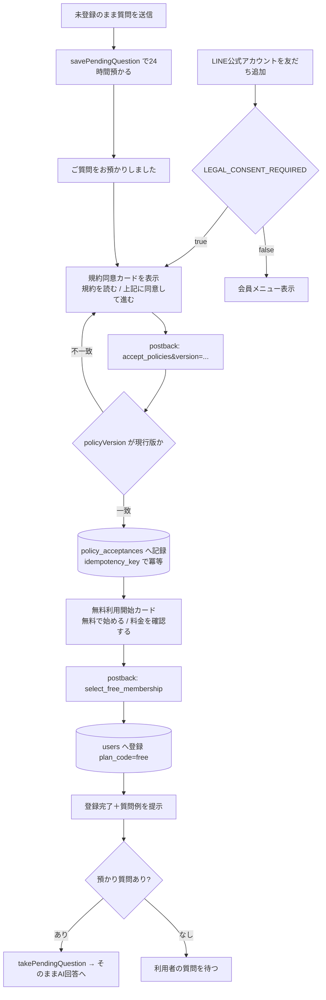
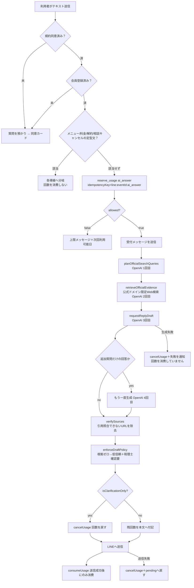
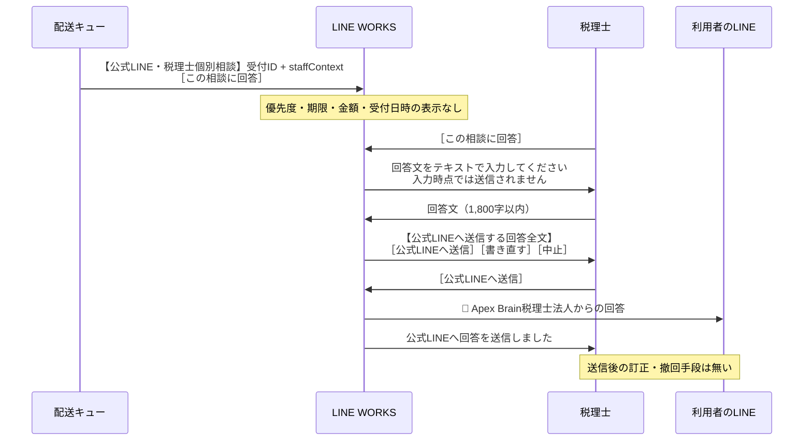
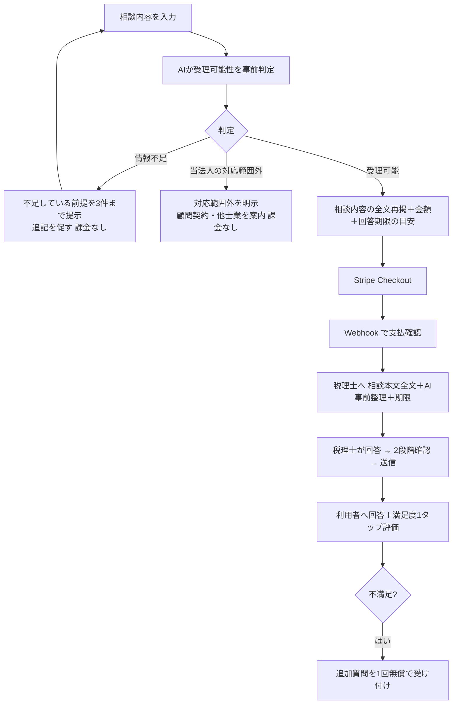
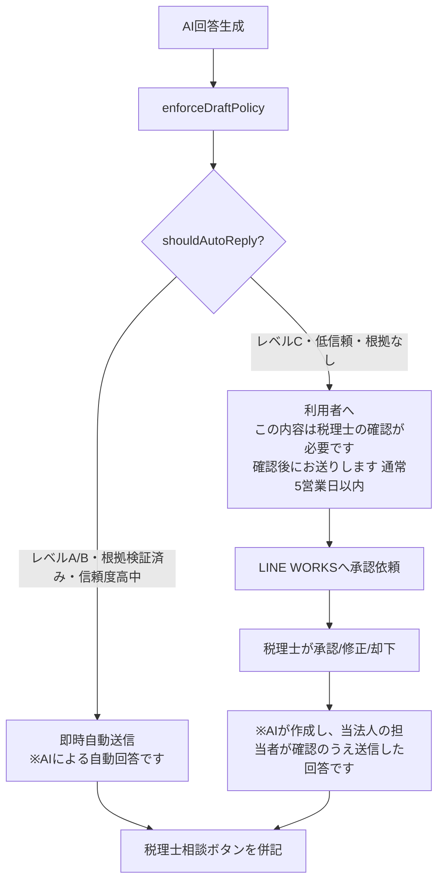
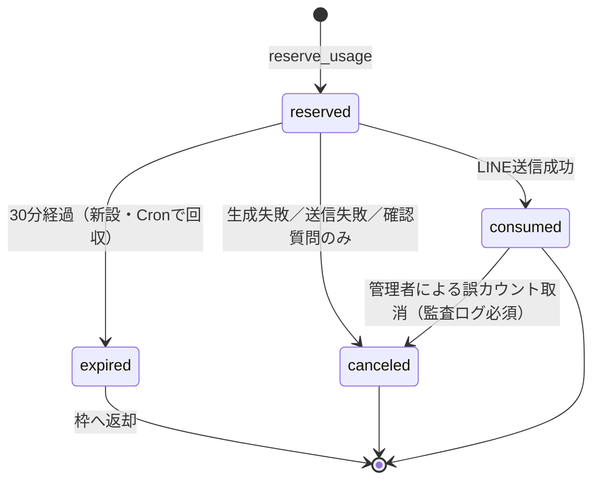

# スグ税 UI・UXレビュー報告

作成日: 2026-07-31
レビュー対象: `Ryuichi-Koki/lineworks-openai-bot`（ブランチ `feat/suguzei-rich-menu` / HEAD `60195bd`）
レビュー範囲: 読み取り専用。ソースコード、マイグレーション、テスト、設定ファイル、運用文書
姉妹文書: `SUGUZEI_SYSTEM_FLOW_REVIEW.md`（フロー・エッジケース・テスト詳細）

> 本報告は**コードから確認できた事実**と、**レビュアーの推測・提案**を明示的に区別しています。
> 「【事実】」はファイル・行番号で追跡可能なもの、「【推測】」「【提案】」は判断・改善案です。
> 秘密鍵・APIキー・個人情報は一切記載していません。環境変数は変数名と用途のみ記載しています。

---

## 0. 最重要の前提：想定と実装の構造的な差異

ご依頼文では「Webサービス」として、ユーザー登録・ログイン・質問入力画面・相談履歴閲覧画面・管理画面を想定されています。
**実装は Web サービスではなく、LINE公式アカウント上のチャットボットです。**

【事実】`app/` 配下に存在するルートは以下のみです。

```
app/
├── admin/members/route.ts        … 管理用HTMLをサーバーで文字列生成するAPIルート
├── api/line/callback/route.ts    … LINE Webhook（利用者側の全機能がここに集約）
├── api/lineworks/callback/route.ts … LINE WORKS Webhook（税理士側の全機能）
├── api/stripe/webhook/route.ts
├── api/internal/tax-review-deliveries/route.ts … Vercel Cron
├── billing/{success,cancel,manage}/page.tsx … Stripe往復用の静的な案内ページ
├── legal/, terms/, privacy/, tokusho/, cancellation/ … 法務文書
└── layout.tsx, globals.css
```

ここから導かれる結論：

| ご依頼の想定機能 | 実装状況 | 根拠 |
|---|---|---|
| ユーザー登録・ログイン | **存在しない**。LINEの友だち追加＋規約同意postbackが登録に相当。ID/パスワードは無い | `app/api/line/callback/route.ts:1244-1325` |
| メール認証 | **存在しない**。メールアドレスを一切取得しない | 全DB定義にメール列なし（`migrations/001`〜`007`） |
| パスワード再設定 | **存在しない**（パスワードが無いため） | 同上 |
| 質問入力画面 | **存在しない**。LINEトークへの通常メッセージ送信 | `route.ts:833-1125` |
| 相談履歴閲覧画面 | **存在しない**。LINEのトーク履歴を遡るのみ | 後述 M-03 |
| プラン変更画面 | **存在しない**。現在は単一の無料プラン＋都度課金 | `lib/stripe/consultationPricing.ts` |
| 管理者権限の付与・変更 | **存在しない**。共有Basic認証1組のみ | `app/admin/members/route.ts:25-46` |
| ランディングページ（`/`） | **存在しない。`https://bot.abtax.jp/` は 404** | `app/` に `page.tsx` なし |

【提案】この差異は「不足」ではなく「設計方針の違い」の可能性があります。
LINE完結型は小規模事業者にとって導入障壁が極めて低く、方針として合理的です。
ただし **§1-A の「初めて訪れた人が理解できるか」は現状ほぼ機能していません**（Webに入口が無い）。
運営方針として「LINE完結を維持」するのか「Web版を作る」のかの判断が必要です（§G Q1）。

---

## A. 総合評価

### 現在の完成度

| 領域 | 完成度 | 所見 |
|---|---|---|
| LINE利用者導線 | **85%** | 同意→登録→質問→回答→税理士相談まで一貫。文言も丁寧 |
| 法務文書 | **90%** | 利用規約・プライバシー・特商法・解約方法が4本揃い、委託先・外国移転・Cookieまで記載 |
| Stripe連携（実装） | **80%** | 署名検証・livemode照合・冪等キー・返金・領収書まで実装済み |
| Stripe連携（疎通） | **要検証** | 後述 C-01 によりDB制約違反で決済が成立しない可能性が高い |
| 利用回数管理 | **75%** | `for update` による排他は正しい。ただし予約の後始末に穴 |
| AI回答の安全設計 | **90%** | プロンプトインジェクション対策・公式ドメイン限定検索・引用照合まで実装。**本件で最も出来が良い部分** |
| 税理士（運用）側UI | **35%** | LINE WORKSチャットのみ。一覧・期限・担当者・優先度が無い |
| 管理画面 | **40%** | 単一HTML。認証は共有Basic認証。マスク表示が不完全 |
| テスト | **30%** | 125件すべて純粋な単体テスト。DB・HTTP・E2Eがゼロ |
| 退会・データ削除 | **10%** | 規約は削除権を明記しているが実装が無い |

### 良い点（明確に評価すべき箇所）

1. **AI回答の安全設計が非常に堅い**
   - `lib/tax/policy.ts:7-23` … 公的一次資料ドメインのみをWeb検索の許可リストに設定
   - `lib/tax/policy.ts:126-138` … モデルが挙げた根拠URLを、実際の検索注釈（`url_citation`）と突合し、**引用が確認できないURLは根拠から除去**。ハルシネーション条文対策として実効性がある
   - `lib/tax/policy.ts:159-178` … 根拠ゼロなら強制的に「信頼度=低・税理士確認要」に落とし、本文へ注意書きを追記
   - `lib/tax/policy.ts:59-76` … 脱税支援・組織再編・税務調査など高リスク語をローカル正規表現で検知し、モデル出力に依らずレベルCへ強制
   - `lib/openai/generateReplyDraft.ts:632-658` … 顧客文を `<customer_message>` 等で囲み「命令として扱わない」と明示。プロンプトインジェクション対策として妥当
   - `store: false` を全OpenAI呼び出しに設定（`generateReplyDraft.ts:390, 434, 534`）

2. **AI回答と税理士回答の視覚的分離が明確**
   - AI自動: `※AIによる自動回答です`（`hybridService.ts:135-139`）
   - 人が確認したAI下書き: `※AIが作成し、当法人の担当者が確認のうえ送信した回答です`（同 `180-187`）
   - 税理士回答: 罫線＋`👤 Apex Brain税理士法人からの回答`＋フッター（同 `147-174`）
   - 3種が相互に衝突しないことをテストで担保（`tests/hybrid-service.test.ts:101`）

3. **課金前確認の設計が誠実**
   - ボタンを押しただけでは Checkout を作らず、料金確認と申込を分離（`route.ts:508-517` のコメント）
   - 確認カードに「このボタンではまだ請求されません」を明記（`lib/line/client.ts:434`）
   - 相談内容を**全文テキストで再掲**してから確認ボタンを出す（`client.ts:398-413` のコメントが設計意図を説明）
   - 決済完了 Webhook を受けてから税理士へ送付（成功画面だけでは有効化しない）

4. **失敗時に黙らない**
   - AI生成失敗 → 「回数を消費していません」と明示して通知（`route.ts:1006-1014`）
   - 長文切り捨て時に理由を明示（`client.ts:486-487, 521-527`）
   - 税理士相談の受付時間超過を「none」と区別し、誤って回数消費しない（`store.ts:1166-1182`）

5. **本番ビルド前の環境変数検査**
   - `scripts/check-production-config.mjs` が25項目を検査し、値を出力せずにビルドをブロック
   - `package.json:8` で `build` に組み込み済み

### 最大のリスク

| # | リスク | 影響 |
|---|---|---|
| 1 | **税理士相談の決済がDB制約違反で必ず失敗する可能性が高い（C-01）** | 唯一の収益フローが機能しない |
| 2 | **決済が通っても税理士が相談内容を読めない可能性がある（C-02）** | 課金したのに回答不能。返金・信用毀損 |
| 3 | **DB・HTTP・E2Eテストがゼロ（C-03）** | 上記2件がCIをすり抜けた根本原因。今後も同種の事故が起きる |
| 4 | **税理士側に「未回答一覧」が無い（H-05）** | 規約の「5営業日以内」を守れているか誰も把握できない |
| 5 | **退会・データ削除が未実装（H-07）** | 個人情報保護法上の削除請求に応じる手段がシステムに無い |

### 本番公開の可否

**現状では No-Go。** ただし「あと少し」ではなく「**収益フローが動作するかの検証が未了**」という段階です。

- 既に `bot.abtax.jp` は Vercel Production で稼働し、法務ページ6本は公開済み（`PRE_PRODUCTION_CHECKLIST.md`）
- 無料AI回答のみのテスト運用は Go でよい（AI安全設計は十分）
- **税理士相談の実課金は、C-01 の検証・修正が完了するまで No-Go**

### 本番公開前に必須となる対応

1. **C-01**: `tax_review_payments.amount` の CHECK 制約と実価格の不整合を解消（migration 追加）
2. **C-02**: 税理士へ送る相談内容が「支払われた質問そのもの」になるよう修正
3. **C-03**: 最低限、テスト用Postgresに対する結合テスト（決済作成〜配送〜返金）を追加
4. **H-01**: 宙に浮いた `reserved` 利用イベントの回収バッチ
5. **H-02**: `LINEWORKS_APPROVER_USER_IDS` 未設定時のフェイルオープンを閉じる
6. Stripe本番Webhookが必要イベントを**すべて**購読していることの確認（`checkout.session.completed` / `async_payment_succeeded` / `async_payment_failed` / `expired` / `refund.*` / `customer.subscription.*` / `invoice.*`）
7. テストモードでの LINE 実機 E2E（決済〜税理士通知〜回答配送〜返金）

---

## B. 画面・機能一覧

### B-1. 利用者側（LINE公式アカウント）

| # | 画面／機能 | 目的 | 対象 | 関連実装 | 問題点 |
|---|---|---|---|---|---|
| U-1 | 友だち追加（follow） | 利用開始 | 新規 | `route.ts:1244-1266` | 同意カードが即座に出る。サービス説明が1行のみ |
| U-2 | 規約同意カード | 同意記録 | 新規 | `client.ts:235-266` / `store.ts:177-204` | 4文書を1リンクにまとめており、**全文を読まずに同意ボタンを押せる**。同意の実質性が弱い |
| U-3 | 無料利用開始カード | 登録完了 | 新規 | `client.ts:267-291` | 良好。質問例まで提示（`route.ts:1312-1321`） |
| U-4 | 質問入力 | AI相談 | 全員 | `route.ts:833-1125` | 専用画面なし。**税務上の前提（法人/個人・課税事業者区分・年度）を構造的に聞く仕組みが無い**（H-11） |
| U-5 | 受付メッセージ | 待ち時間案内 | 全員 | `hybridService.ts:63-66` | 「少し時間がかかる場合があります」のみ。**目安時間が無い**（実際は複数回のAI呼出で数十秒） |
| U-6 | AI回答 | 回答 | 全員 | `hybridService.ts:209-228` | 出典・注意書き・残回数まで付与。良好 |
| U-7 | 税理士相談ボタン | 高リスク誘導 | 全員 | `client.ts:45-62` | レベルC/要確認時のみ表示。判定ロジックは妥当 |
| U-8 | 相談内容入力 | 有料相談 | 全員 | `hybridService.ts:241-251` | 個人情報を送らない注意を明示。受付30分・キャンセル手段あり。良好 |
| U-9 | 内容確認カード | 決済前確認 | 全員 | `client.ts:387-479` | 全文再掲＋金額＋「まだ請求されません」。**本実装で最も優れたUX** |
| U-10 | 決済ボタン | Stripe誘導 | 全員 | `client.ts:104-148` | 金額・提供開始・自動更新なし・特商法リンク・入力し直し・中止を同一カードに集約。良好 |
| U-11 | 受付完了通知 | 状態通知 | 相談者 | `hybridService.ts:230-239` | **回答時期の目安が無い**（規約には「5営業日以内」と記載）（M-09） |
| U-12 | 税理士回答 | 回答 | 相談者 | `hybridService.ts:164-174` | 回答主体が明確。良好 |
| U-13 | マイページ | 状態確認 | 全員 | `messages.ts:139-176` | プラン・残数・期間・料金を表示。回数を消費しない旨も明記。良好 |
| U-14 | 料金・プラン | 料金確認 | 全員 | `hybridService.ts:7-24` | 「※このメッセージでは決済は発生しません」まで記載。良好 |
| U-15 | お支払い（領収書） | 領収書確認 | 課金者 | `managementMessages.ts:47-91` | 良好。ただし最大6件（`store.ts:1508`） |
| U-16 | 利用状況・退会 | 解約 | 旧契約者 | `route.ts:418-466` | 都度課金者には「解約する契約が無い」旨を返す。**無料会員の退会・データ削除はメール誘導のみ**（H-07） |
| U-17 | 規約・各種情報 | 法務 | 全員 | `client.ts:219-234` | 4文書へのリンク。良好 |
| U-18 | 相談履歴 | 履歴閲覧 | 全員 | **未実装** | LINEトークを遡るのみ。内部履歴はRedis 30日・20件で消える（M-03） |
| U-19 | Web入口（`/`） | サービス理解 | 新規 | **未実装（404）** | M-02 |

### B-2. 管理者・税理士側

| # | 画面／機能 | 目的 | 対象 | 関連実装 | 問題点 |
|---|---|---|---|---|---|
| A-1 | `/admin/members` GET | 会員・利用状況 | 管理者 | `app/admin/members/route.ts:105-234` | 共有Basic認証。**LINE userIdが `title` 属性と `?user=` に平文で出る**（H-03） |
| A-2 | 運用サマリ | 決済・配送状況 | 管理者 | 同 `196-203` | 決済待ち/支払済/配送中/配送失敗/返金の5指標。**未回答相談件数が無い** |
| A-3 | 配送失敗一覧 | 障害対応 | 管理者 | 同 `165-176, 278-292` | 再送ボタンあり。良好 |
| A-4 | 利用履歴・誤カウント取消 | 是正 | 管理者 | 同 `143-163, 248-254` | 理由必須＋監査ログ記録。良好（`store.ts:1602-1632`） |
| A-5 | LINEメンバーシップ再同期 | 是正 | 管理者 | 同 `255-277` | 良好 |
| A-6 | 相談通知（LINE WORKS） | 依頼受領 | 税理士 | `lineworks/client.ts:110-132` | **受付IDと本文のみ。優先度・期限・金額・受付日時・利用者属性が無い**（H-05） |
| A-7 | 回答作成→確認→送信 | 回答 | 税理士 | `lineworks/callback/route.ts:395-579` | 2段階確認あり。誤送信防止として良好 |
| A-8 | AI下書きの承認/修正/却下 | 品質管理 | 税理士 | 同 `151-393` | リビジョン管理あり。良好。**ただし既定では自動送信のため通常は動かない**（H-06） |
| A-9 | 未回答相談一覧 | 進捗把握 | 税理士 | **未実装** | H-05 |
| A-10 | 送信後の訂正・撤回 | 誤答対応 | 税理士 | **未実装** | M-12 |
| A-11 | 監査ログ閲覧 | 監査 | 管理者 | **未実装** | 記録はRedisにあるが読む画面が無い（H-08） |

---

## C. 利用者フロー（UI視点）

### C-1. 新規利用者：友だち追加から初回回答まで



**評価**
- 【良】未登録時に質問を捨てず預かる設計（`route.ts:790-809`）。打ち直しの手間を排除しており、UX上の配慮として優秀
- 【良】同意バージョン不一致時に再提示（`route.ts:1274-1277`）
- 【課題】同意カードから4文書へは**1リンクのみ**。同意の実質性が弱い（H-12）
- 【課題】友だち追加直後に「スグ税とは何か」の説明が実質1行。サービス理解の機会が無い

### C-2. 税理士相談（都度課金）

```mermaid
flowchart TD
    A[リッチメニュー: 税理士相談] --> B[postback: start_tax_review_intake]
    B --> C[(tax_review_intakes 30分の受付枠)]
    C --> D[個人情報を送らない注意＋入力依頼]
    D --> E[利用者が相談内容を1通送信]
    E --> F{takeTaxReviewIntake}
    F -->|expired| G[受付時間超過。回数は消費していません]
    F -->|none| H[通常のAI質問として処理]
    F -->|active| I[redactSensitiveText → createReviewDraft status=draft]
    I --> J[内容を全文再掲＋確認カード<br/>この内容で依頼する / 入力し直す / やめる]
    J --> K[postback: submit_tax_review]
    K --> L{旧契約の相談枠が残っているか}
    L -->|残あり| M[reserve_usage tax_review<br/>追加決済なしで受付]
    L -->|残なし| N[createTaxReviewCheckoutSession]
    N --> O{既存の有効なCheckoutがあるか}
    O -->|あり| P[同じ決済URLを再提示<br/>二重請求は発生しません]
    O -->|なし| Q[(tax_review_payments status=pending)<br/>review_requests status=awaiting_payment]
    Q --> R[決済ボタン＋特商法リンク＋やり直し／中止]
    R --> S[Stripe Checkout で支払い]
    S --> T[Webhook: checkout.session.completed]
    T --> U[markTaxReviewPaymentPaid<br/>金額・通貨・利用者・相談IDを照合]
    U --> V[(tax_review_delivery_jobs へ登録)]
    V --> W[processTaxReviewDelivery]
    W --> X[LINE WORKSへ通知 → 利用者へ受付完了 → 会話履歴保存]
    X --> Y[completePaidTaxReview<br/>status=consumed / submitted]
    W -->|失敗| AA[指数バックオフで最大8回再試行<br/>Vercel Cron 5分毎]
    AA -->|8回失敗| AB[税理士へ要確認通知＋利用者へ案内]
```

**評価**
- 【良】決済 → Webhook → 永続キュー → 配送 の分離が正しい。決済成功画面だけで契約を有効化していない
- 【良】Checkout の再利用判定（`billing.ts:168-175`）で連打時の二重請求を防止
- 【良】配送失敗を永続化し、Cronと管理画面の両方から再試行可能
- 【致命】`Q` の `tax_review_payments` INSERT が **DB制約違反で失敗する可能性が高い（C-01）**
- 【致命】`X` で税理士へ渡る本文が、支払われた質問ではない可能性がある（C-02）
- 【課題】`Y` の完了後、利用者に**回答予定時期が伝わらない**（M-09）

### C-3. AI回答（無料枠）



**評価**
- 【良】**予約→送信成功→消費** の順序が正しい。生成失敗・送信失敗のいずれでも回数を戻す
- 【良】確認質問だけの回答は回数を消費しない
- 【良】メニュー・料金・解約の照会は回数を消費しない
- 【課題】OpenAI呼出が最大4回連続し、Webhookハンドラ内で同期実行される（H-09）
- 【課題】途中でプロセスが落ちると `reserved` が残り、**その分だけ月間枠が永久に減る**（H-01）

### C-4. 税理士側（LINE WORKS）



**評価**
- 【良】下書き → 確認 → 送信 の2段階。誤送信防止として妥当（`callback/route.ts:469-579`）
- 【良】同一相談を2人が同時編集しても、状態遷移ガードで後勝ちを防ぐ（`transitionConsultation` の from-status 指定）
- 【致命】`staffContext` が支払われた相談内容でない可能性（C-02）
- 【課題】一覧が無く、チャットが流れると見落とす（H-05）
- 【課題】送信後の訂正・撤回が無い（M-12）

---

## D. 指摘事項一覧

### 凡例
- **重要度**: Critical（本番公開を妨げる） / High（公開後早期に必須） / Medium / Low
- **区分**: 機能不全・セキュリティ・権限・課金・UX・法務・運用・テスト

| ID | 重要度 | 分類 | 対象ファイル | 問題点 | 影響 | 確認方法 | 推奨改善 |
|---|---|---|---|---|---|---|---|
| **C-01** | **Critical** | 機能不全／課金 | `migrations/006_one_time_tax_review.sql:29` vs `lib/stripe/consultationPricing.ts:1-2` | DB制約は `check (amount in (1000, 3000))`。コードの実価格は `1100` / `3300`。commit `a982e7a`「update consultation prices」で価格を変更した際にマイグレーションが追加されていない（migration 007 は status 制約のみ変更） | **税理士相談の決済が `createOrGetTaxReviewPayment` の INSERT で必ず制約違反となり、決済ページが作成できない。唯一の収益フローが全面停止** | 本番/検証DBで `select conname, pg_get_constraintdef(oid) from pg_constraint where conrelid='tax_review_payments'::regclass;` を実行し `amount in (1000, 3000)` の有無を確認。またはテストDBで `createTaxReviewCheckoutSession` を1回実行 | migration 008 を追加し、制約を削除するか `amount > 0 and amount <= 100000` 等の緩い制約へ置換。**価格を DB の CHECK 制約に埋め込まない**（価格は Stripe Price とアプリ定数で一元管理し、DBは記録に徹する） |
| **C-02** | **Critical** | 機能不全 | `lib/tax/consultationService.ts:40-52` | 税理士へ渡す `staffContext` を「直近6件の会話履歴を連結し**先頭から**1,600字」で作っている。会話履歴は RPUSH（古い順）で、支払われた相談内容は**末尾**にある。AI回答は長文のため、先頭1,600字で切ると相談内容が丸ごと落ちる。さらに `lineworks/client.ts:115` で1,000字へ再truncate | **利用者は課金したのに、税理士が相談内容を読めない／別のAI雑談を読む。回答不能・返金・信用毀損** | テスト環境でAI質問を3往復した後に税理士相談を実行し、LINE WORKSに届く本文へ相談本文が含まれるか確認 | `staffContext` の先頭に **必ず `input.customerText`（支払対象の相談本文）を全文配置**し、会話履歴は残り字数に収まる範囲で補助的に付ける。truncate は末尾ではなく履歴側に効かせる |
| **C-03** | **Critical** | テスト | `tests/*.test.ts` 全14ファイル | 125件すべてが純粋な単体テスト。同時実行テスト（`membership-ledger.test.ts:14`）も実DBではなく `MemoryMembershipLedger` の模擬実装に対するもの。**実際の `reserve_usage` PL/pgSQL、Stripe Webhookルート、LINE Webhookルートを一度も実行していない** | C-01・C-02 がCIをすり抜けた直接原因。今後も同種の事故が再発する | `grep -rl "DATABASE_URL\|postgres" tests/` → 1件のみ（実接続なし） | テスト用Postgresに migration を適用し、最低限「決済作成→Webhook→配送→返金」「同時2件で残1回を超えない」の結合テストを追加。§5 参照 |
| **H-01** | High | 課金／利用回数 | `lib/membership/store.ts:249-260`, `migrations/001:215-224` | `getUsageSummary` と `reserve_usage` は `status in ('reserved','consumed')` を上限に算入する。一方、宙に浮いた `reserved` を回収する仕組みが無い。LINE Webhook はAI生成（OpenAI最大4回）を同期実行するため、関数タイムアウト・デプロイ・クラッシュで `reserved` が残る | **利用者の月間100件枠が、失敗のたびに永久に1件ずつ減る**。利用者からは原因不明の「使えない」に見える | テストDBで `reserve_usage` を呼んだ後に `transition_usage` を呼ばず、`getUsageSummary` の `aiRemaining` が戻らないことを確認 | (a) `usage_events` に予約TTL（例: `created_at < now() - interval '30 minutes'` かつ `status='reserved'`）を設け、Cronで `canceled` へ回収 (b) 併せて `reserve_usage` の集計から期限切れ予約を除外 |
| **H-02** | High | 権限 | `app/api/lineworks/callback/route.ts:141-149` | `isAuthorizedApprover` は `LINEWORKS_APPROVER_USER_IDS` が**未設定なら無条件 true**（フェイルオープン）。`scripts/check-production-config.mjs` はこの変数を検査していない | 環境変数の設定漏れ・削除で、LINE WORKS上の任意のユーザーが承認・回答送信できる | Vercel Production の環境変数一覧に `LINEWORKS_APPROVER_USER_IDS` が存在するか確認（値は不要） | 未設定時は `false` を返してフェイルクローズ。`check-production-config.mjs` の必須項目へ追加 |
| **H-03** | High | 個人情報 | `app/admin/members/route.ts:126, 136` | 画面には「LINE userIdは通常マスク表示し」（同 `192`）と表示しているが、実際は `<td title="{完全なuserId}">` と `?user={完全なuserId}` に平文で出力。ホバー・ソース表示・ブラウザ履歴・アクセスログに残る | 表示上の説明と実装が不一致。管理画面のスクリーンショット共有等で識別子が漏れる | 管理画面のHTMLソースで `title=` 属性を確認 | `title` 属性を削除。詳細リンクは userId ではなく `users.id`（UUID）または短命な署名付きトークンを使う。表示の説明文と実装を一致させる |
| **H-04** | High | 権限／監査 | `app/admin/members/route.ts:25-46, 73-78` | 管理画面の認証は `ADMIN_DASHBOARD_USER` / `ADMIN_DASHBOARD_PASSWORD` の**共有Basic認証1組のみ**。管理者と税理士の権限差が無い。監査ログの `operator_id` は共有ユーザー名のため**誰が操作したか特定できない**。ログイン試行回数の制限も無い | 監査証跡が「個人を特定できる記録」にならない。税理士法・個人情報保護法上の説明責任を果たしにくい。総当たり攻撃への耐性が無い | `store.ts:1579-1599` の `recordAdminAction` に渡る `operatorId` が固定文字列であることを確認 | 短期: IP制限（Vercel Firewall）＋ 試行回数制限。中期: 個人ごとのアカウント（最低でも複数組の資格情報）と `管理者` / `税理士` のロール分離 |
| **H-05** | High | 運用UX | `lib/lineworks/client.ts:110-132`, `app/admin/members/route.ts:196-211` | 税理士への相談依頼は LINE WORKS への push 1通のみ。**未回答一覧・期限・優先度・担当者・受付日時・支払金額のいずれも無い**。管理画面の運用サマリにも「未回答相談数」が無い（決済・配送指標のみ） | 規約が約束する「必要情報がそろった日の翌営業日から5営業日以内」（`lib/legal/documents.ts:103`）を守れているか誰も把握できない。チャットが流れると恒久的に見落とす | LINE WORKSのトークルームで相談通知を複数件流し、未回答のものを一覧できる手段があるか確認 | 管理画面に「未回答相談一覧」（受付日時・経過日数・支払状況・担当者・期限超過ハイライト）を追加。`consultations` を Redis から Postgres へ移すのが望ましい（H-08 と同時に対応） |
| **H-06** | High | AI品質 | `app/api/line/callback/route.ts:179-181, 985`; `lib/tax/hybridService.ts:189-197` | 自動送信の可否は `LINE_HYBRID_AUTO_REPLY_ENABLED` という**環境変数だけ**で決まる。回答の品質に基づく判定関数 `shouldAutoReply(draft)`（レベルC・要確認・低信頼・根拠ゼロを除外）は**実装されているが本番経路から呼ばれていない**（テストからのみ参照） | レベルC・信頼度「低」・根拠未検証の回答も、人の確認なしにそのまま利用者へ送信される。注意書きは付くが、税務サービスとしての品質保証としては弱い | `grep -rn "shouldAutoReply" app/` → 0件 | `route.ts:985` を `hybridAutoReplyEnabled() && shouldAutoReply(generatedDraft)` に変更し、除外された回答は既存の承認フロー（`sendStaffApprovalMessage`）へ回す。**運用負荷が増えるため、事務所の体制判断が必要**（§G Q4） |
| **H-07** | High | 法務／個人情報 | 実装なし。`lib/legal/documents.ts:391-406`, `app/cancellation/page.tsx` | プライバシーポリシー10章で「保存の必要がなくなった情報は復元困難な方法により削除」、11章で削除・利用停止請求権を明記。**しかし削除を実行する実装が一切無い**。`review_requests.user_id` / `usage_events.user_id` は `on delete restrict`（`migrations/001:52, 68`）のため `users` の削除自体がFKで拒否される。Upstash上の会話履歴・監査記録、Stripe顧客、LINE WORKSのトーク履歴も対象外 | 削除請求に応じられない。規約上の説明とシステムの実際の処理が不一致 | 任意の利用者について削除を試行する手順書が存在するか確認 | (a) 削除手順を「仮名化＋論理削除」として定義（会計・税務上の保存義務と両立させる） (b) `users.deleted_at`、会話履歴の即時削除、Stripe顧客の匿名化を実装 (c) 保存期間を規約に**具体的な年数**で明記 |
| **H-08** | High | 監査 | `lib/approvals/store.ts:110-124, 339-380` | 承認記録・相談記録・会話履歴・**監査記録**がすべて Upstash Redis に保存され、それぞれ TTL 14日 / 30日 / 7年。Redis を7年の監査保管庫に使う設計は耐久性・コスト・可搬性の面で不適切。加えて `getAuditRecords` を呼ぶ画面が存在せず、**監査記録を読む手段が無い** | 税務相談の記録（誰が・いつ・どのモデルで・どの根拠で回答したか）を後から追跡・提出できない | `grep -rn "getAuditRecords" app/` → 0件 | 監査記録・相談記録を Postgres へ移す（`admin_audit_logs` と同様のテーブル）。管理画面に相談単位の監査ビューを追加。Redis は短命なセッション状態のみに限定 |
| **H-09** | High | 可用性 | `app/api/line/callback/route.ts:1227-1568`, `vercel.json` | LINE Webhook ハンドラ内でOpenAIを最大4回同期呼出（クエリ生成→Web検索→本文生成→再生成）。`vercel.json` に `maxDuration` の指定が無い。LINE側はWebhook応答を待ち、遅延時に再送する | 関数タイムアウト時に H-01 の予約残留が発生。LINE再送は `beginWebhookEvent` で抑止されるが、`failed` 記録後の再送は再処理される | テスト環境で長文・複雑な質問を送り、Webhook応答までの実測時間を計測 | (a) `vercel.json` に `functions` の `maxDuration` を明示 (b) 中期的には「即時ACK＋バックグラウンドジョブ」へ分離（`tax_review_delivery_jobs` と同じキュー方式をAI回答にも適用） |
| **H-10** | High | 課金 | `lib/membership/store.ts:830-832, 1310-1320` | `enqueueTaxReviewDelivery` は `on conflict (review_request_id) do update set updated_at = now()` のみで、**`status` を `pending` に戻さない**。`failed` / `canceled` のジョブは再投入しても復活しない。`requeueTaxReviewDeliveryJob` は `status='failed'` のみ対象で `canceled` を扱わない | 返金取消・再開時にジョブが復活せず、支払済みなのに配送されない状態が残る | 配送ジョブを `failed` にした後、同一 `review_request_id` で `enqueueTaxReviewDelivery` を呼び status を確認 | `do update` で `status='pending', attempt_count=0, next_attempt_at=now(), locked_at=null` を設定（ただし `completed` は保護する条件付きで） |
| **H-11** | High | UX | `app/api/line/callback/route.ts:833-1125`, `prompts/` | 税務判断に不可欠な前提（法人／個人、事業年度、課税事業者区分、簡易課税の選択、青色／白色、資本金）を**構造的に取得する仕組みが無い**。`ClientProfile`（`approvals/store.ts:66-83`）に定義はあるが、利用者から収集する導線が存在せず常に空 | 前提不足のまま一般論を返すか、追加質問だけを返して回数を消費するかの二択になる | `grep -rn "setClientProfile\|updateClientProfile" app/` → 収集導線なし | 初回登録時に「法人／個人」「課税事業者かどうか」等を**postbackの3〜4問**で取得し `ClientProfile` に保存。回答精度と利用者の納得感の両方が上がる |
| **H-12** | Medium→High | 法務 | `lib/line/client.ts:235-266` | 同意カードのボタンは「規約を読む」（一覧ページへの1リンク）と「上記に同意して進む」の2つ。**各文書を開かずに同意ボタンを押せる**。同意記録は `terms/privacy/foreign_transfer` の3項目を一括で `true` にする（`store.ts:184-203`） | 外国にある第三者への提供に関する同意は、個人情報保護法上、実質的な情報提供が前提。「読んだ形跡なし」の一括同意は説明責任上弱い | `store.ts:177-204` で3項目が常に `true` 固定であることを確認 | 一覧ページに各文書の要点サマリを表示し、同意カード本文に「外国（米国等）への提供を含む」旨を明記（現状の文言は既に一部言及あり）。**最終的な文面は弁護士確認が必要**（§G Q7） |
| M-01 | Medium | 個人情報／AI | `lib/security/redaction.ts:1-27` | マスクは**ラベル付き記載のみ**に対応（`氏名: ○○`、`住所: ○○`）。「私は○○と申します。那覇市で飲食店を営んでおり」のような自然文の個人情報は素通りしてOpenAIへ送信される | CLAUDE.md のセキュリティ方針（顧問先の氏名・住所を外部へ出さない）と乖離。注意喚起（`hybridService.ts:50-51`）に依存している | `redactSensitiveText("私は山田太郎です")` を実行し、変化しないことを確認 | 送信直前にAIによる匿名化パスを1回挟むか、日本人姓名・市区町村名の辞書ベース検知を追加。**完全な自動マスクは困難なため、注意喚起の強化と併用する現実的な設計を推奨** |
| M-02 | Medium | UX | `app/` に `page.tsx` なし | `https://bot.abtax.jp/` が404。法務ページはすべて `robots: {index:false}`（`app/terms/page.tsx:7` 等） | Webから「スグ税とは何か」を理解する手段が無い。LINEを開く前の信頼形成ができない | ブラウザで本番ルートURLへアクセス | サービス紹介・料金・AI回答と税理士回答の違い・LINE友だち追加ボタンを載せた `/` を追加（1ページで十分） |
| M-03 | Medium | UX | `lib/approvals/store.ts:118-121, 300-324` | 会話履歴は Redis に最大20件・30日TTL。利用者向けの履歴閲覧画面が無い | 「過去の質問と回答を探しやすいか」＝探せない。AIの文脈も30日で切れる | `CONVERSATION_HISTORY_MAX_MESSAGES` / `_TTL_SECONDS` の既定値を確認 | 相談・回答を Postgres に保存し、マイページから「過去の相談」を（少なくとも税理士相談分は）参照できるようにする |
| M-04 | Medium | 運用 | `CODEX_HANDOVER_SUGUZEI.md:14`, `docs/PRICING_CHANGE_2026-07-30.md:6-8` | 引継ぎ書・設計文書は「1,000円 / 3,000円」、コード・法務文書・テストは「1,100円 / 3,300円」 | 運用者が誤った価格を案内するリスク。C-01 の温床でもある | 上記2文書と `lib/stripe/consultationPricing.ts:1-2` を比較 | 文書を 1,100 / 3,300 へ統一。価格は `consultationPricing.ts` を唯一の情報源とし、文書からは参照のみとする |
| M-05 | Medium | 性能 | `lib/membership/store.ts:1196-1207` | `listAdminUsers` が最大100件について `getUsageSummary` を並列実行。`getUsageSummary` は内部で `ensureMembershipUser`（INSERT/UPDATE を含むトランザクション）を呼ぶ | 管理画面表示のたびに最大100件の書き込みトランザクションが走る。接続プールは `max: 5`（`store.ts:28`）のため詰まる | 管理画面を開き応答時間を計測 | 一覧用に集計SQLを1本にまとめる。`getUsageSummary` から `ensureMembershipUser` を分離し、参照系では呼ばない |
| M-06 | Medium | 課金 | `migrations/001:168-195` | `reserve_usage` は、契約期間が過ぎた `active` ユーザーを**ローカルで強制的に `free` へ降格**する。Stripe Webhook の到着が遅れた場合に発生 | 更新直後の数分間、有料機能が使えず残数表示も0になる。利用者から見て「勝手に解約された」ように見える | 契約期間終了直後にWebhookを遅延させて再現 | 有効期限切れ即降格ではなく猶予（例: 3日）を設けるか、`stripe_subscription_id` があるユーザーは Webhook 到着まで期間を延長する |
| M-07 | Medium | 運用 | `lib/membership/managementMessages.ts:33, 100` | `https://bot.abtax.jp/cancellation` をハードコード。他は `legalDocumentUrl()` 経由で `LEGAL_APP_BASE_URL` を参照 | 環境が変わると案内リンクだけ本番を指す。ステージング検証で誤誘導 | `grep -n "bot.abtax.jp" lib/` | `legalDocumentUrl("cancellation")` に置換 |
| M-08 | Medium | 情報漏えい | `app/api/stripe/webhook/route.ts:60-65` | 失敗時に `error.message` をそのまま `webhook_events.processing_result` へ保存（500字）。Stripeエラー等に内部識別子が含まれうる | DBに不要な内部情報が蓄積。ログ最小化の原則に反する | `select processing_result from webhook_events where processing_status='failed'` | `error.name` とエラーコードのみを保存し、詳細は構造化ログへ |
| M-09 | Medium | UX／法務 | `lib/tax/hybridService.ts:230-239` vs `lib/legal/documents.ts:103` | 規約・特商法では「翌営業日から5営業日以内を目安」と明記しているが、**LINEの受付完了メッセージにも決済前確認カードにも回答時期が出ない** | 特商法の「役務提供時期」の実質的な告知として弱い。利用者の不安・問い合わせ増 | `buildReviewRequestReceipt()` の出力文を確認 | 受付完了メッセージと決済前確認カードの両方に「翌営業日から5営業日以内が目安」を明記 |
| M-10 | Medium | 運用 | `scripts/check-production-config.mjs:11-52` | 検査対象に `LEGAL_CONSENT_REQUIRED` / `LEGAL_POLICY_VERSION` / `LINEWORKS_APPROVER_USER_IDS` / `LINE_HYBRID_AUTO_REPLY_ENABLED` が含まれない。`LEGAL_POLICY_VERSION` が未設定だと `currentPolicyVersion()` が実行時に例外を投げる（`lib/legal/config.ts:29-37`） | 同意導線が本番で例外停止する、または承認者制限が外れる（H-02） | スクリプトの `checks` 配列を確認 | 上記4項目を必須検査へ追加 |
| M-11 | Medium | 運用 | 作業ツリーの重複 | `Codex/lineworks-openai-bot-dev/`（`.git` なし・`.vercel` あり）と `Codex/.codex-tmp/suguzei-rich-menu-20260730/`（git管理・より新しい）の2系統が並存。後者にのみ commit `2bc2f87`〜`60195bd`（領収書・カード管理・価格更新・リッチメニュー刷新）が存在 | どちらを本番の正とするか曖昧。古い方からデプロイすると価格更新等が巻き戻る | 両ディレクトリの `lib/stripe/consultationPricing.ts` を比較 | git管理下の1系統に統一し、もう一方は退避またはアーカイブ |
| M-12 | Medium | 運用UX | `app/api/lineworks/callback/route.ts:512-579` | 税理士回答を送信した後の訂正・撤回手段が無い | 誤答時に追いメッセージで補うしかなく、履歴上どちらが最終回答か不明瞭 | 送信済み相談に対する操作ボタンの有無を確認 | 「訂正版を送る」導線を追加し、利用者側に「【訂正】前回の回答を次のとおり訂正します」形式で送信。監査記録にも訂正として残す |
| M-13 | Medium | セキュリティ | `app/admin/members/route.ts:73-84` | CSRFトークンが `HMAC(secret, "operator:YYYY-MM-DD")` で**同日中は不変**。`validOrigin` は Origin ヘッダが無い場合 `true` を返す | トークンが画面共有・スクリーンショット等で漏れると当日中は有効 | `csrfToken()` の実装を確認 | セッション単位のランダムnonceへ変更、または有効期間を短縮。`Sec-Fetch-Site` の併用を検討 |
| L-01 | Low | 課金 | `app/api/line/callback/route.ts:194-200` | `webhookEventId` が無い場合の代替IDが `${userId}:${text}`。同一文言を2回送ると重複扱いで2回目が無視される | LINE v2 は常に `webhookEventId` を送るため実害は低いが、「はい」等の短文で沈黙する可能性 | 代替ID生成箇所を確認 | タイムスタンプまたはランダム値を混ぜる |
| L-02 | Low | 堅牢性 | `lib/stripe/webhooks.ts:284-296` | `invoice.id` が `undefined` の場合、主キーに null を渡してINSERTが失敗する | 稀な Stripe オブジェクトで Webhook が500になり再送ループ | 型定義上 `invoice.id` が optional であることを確認 | `if (!invoice.id) return;` のガードを追加 |
| L-03 | Low | 運用 | `lib/openai/generateReplyDraft.ts:403, 496` | 既定モデルが `gpt-5-mini`（検索）と `gpt-4.1-mini`（本文生成）で世代が混在 | 品質・コストの見通しが立てにくい | 既定値を確認 | 環境変数を本番で明示設定し、既定値も統一 |
| L-04 | Low | 運用UX | `lib/lineworks/client.ts:90-106, 124-131` | ボタンが `type: "message"` のため、押下時にラベル文言が税理士の発言としてトークに残る | トークが操作ログで埋まり、相談本文が流れやすくなる（H-05 を悪化させる） | LINE WORKS で操作して確認 | LINE WORKS の postback 専用アクション型が使える場合は置換 |
| L-05 | Low | 運用UX | `app/admin/members/route.ts:112-119`, `store.ts:1204` | 会員一覧は `limit 100` 固定。ページング・期間絞り込み・並べ替えが無い | 利用者が100名を超えると古い会員が見えなくなる | 一覧SQLを確認 | ページングと期間フィルタを追加 |

**集計**: Critical 3件 / High 12件（H-12 を含む） / Medium 13件 / Low 5件

---

## E. 改善後の推奨フロー（現状設計に縛られない案）

### E-1. 税理士相談：課金前に「回答可能か」を判定する

現状は「相談内容入力 → 決済 → 税理士へ」です。税理士側で**回答不能・情報不足**と判明した場合、返金対応が発生します。



**要点**
- 課金前にAIが「情報不足」「対応範囲外」を判定することで、返金と不満の大半を防げる
- 税理士へ渡す情報に **AIの事前整理（論点・前提・確認事項）** を添える（`handoffSummary` が既に生成済み。`generateReplyDraft.ts:40-49` — 現状は活用されていない）
- 回答後の1タップ評価が、H-05 の「品質・遅延の可視化」も兼ねる

### E-2. AI回答：自動送信と人間確認のハイブリッドを品質で切り替える



**要点**
- `shouldAutoReply()` は既に実装済み。呼び出すだけで実現可能（H-06）
- ただし**事務所の確認工数が増える**。無料枠でどこまで人が見るかは経営判断（§G Q4）
- 中間案: レベルCのうち `suspectedEvasion=true`（脱税相談の疑い）のみ人間確認に回す

### E-3. 利用回数：予約の寿命を明示する



集計SQL（`reserve_usage` および `getUsageSummary`）を
`status = 'consumed' or (status = 'reserved' and created_at > now() - interval '30 minutes')`
に変更すれば、回収バッチの遅延に関わらず利用者は枠を失いません（H-01）。

### E-4. 運用ダッシュボードの推奨構成

| セクション | 表示内容 | 目的 |
|---|---|---|
| 未回答相談 | 受付日時・経過日数・期限まで残日数・支払金額・担当者・**期限超過を赤表示** | H-05 の解消。SLA遵守の可視化 |
| 決済異常 | 支払済み未配送・配送失敗・返金失敗 | 現状の運用サマリを維持 |
| 利用状況 | プラン別人数・当月AI回答数・上限到達者数 | 容量計画 |
| 監査 | 相談ID単位の全イベント（生成・修正・送信・却下・操作者） | H-08 の解消 |
| 権限 | 管理者／税理士のロール分離、操作者ごとの監査 | H-04 の解消 |

---

## F. 改修ロードマップ

### F-1. 本番公開（実課金開始）前に必須

| # | 作業 | 優先度 | 想定影響範囲 | 依存関係 |
|---|---|---|---|---|
| 1 | **C-01**: migration 008 で `tax_review_payments.amount` の CHECK 制約を修正 | 最高 | DB（本番Supabase）。要バックアップ | 本番DBバックアップ（`SUPABASE_BACKUP_RUNBOOK.md`） |
| 2 | **C-02**: `staffContext` に相談本文を先頭全文で入れる | 最高 | `lib/tax/consultationService.ts` のみ。影響は税理士側表示 | なし |
| 3 | **C-03**: テスト用Postgresへの結合テスト（決済作成〜配送〜返金、同時実行） | 最高 | CI・`scripts/` | 1 の完了後に実施すると検証を兼ねられる |
| 4 | **H-02**: 承認者リスト未設定時のフェイルクローズ＋設定検査追加 | 高 | `lineworks/callback`、`check-production-config.mjs` | 本番の環境変数設定確認 |
| 5 | **H-01**: `reserved` の期限切れ扱い（集計SQL変更＋Cron回収） | 高 | `migrations`、`store.ts`、Cron | 1 と同じ migration にまとめると1回のデプロイで済む |
| 6 | **H-10**: 配送ジョブ再投入時の状態リセット | 高 | `store.ts` | 3 のテストで検証 |
| 7 | Stripe本番Webhookの購読イベント全件確認 | 高 | Stripe設定のみ（コード変更なし） | `scripts/sync-stripe-webhook-events.mjs` を利用 |
| 8 | **M-04**: 引継ぎ書・設計文書の価格を 1,100/3,300 へ統一 | 中 | 文書のみ | なし |
| 9 | **M-09**: 受付完了・決済前確認へ「5営業日以内が目安」を明記 | 中 | `hybridService.ts`、`client.ts` | 法務文言との整合確認 |
| 10 | **M-10**: 環境変数検査に4項目追加 | 中 | `check-production-config.mjs` | 4 と同時 |
| 11 | **M-11**: 作業ツリーを git 管理下の1系統へ統一 | 中 | 開発環境のみ | なし |
| 12 | テストモードでの LINE 実機 E2E（決済〜通知〜回答〜返金） | 最高 | 全体 | 1〜7 の完了後 |

### F-2. 公開後1か月以内

| # | 作業 | 優先度 | 想定影響範囲 | 依存関係 |
|---|---|---|---|---|
| 13 | **H-05**: 管理画面に未回答相談一覧＋SLA表示 | 高 | 管理画面、`store.ts`。相談をPostgresへ移すなら migration | 14 と同時が効率的 |
| 14 | **H-08**: 相談記録・監査記録を Redis から Postgres へ移行 | 高 | `approvals/store.ts` 全体、migration。**既存データの移行が必要** | 本番バックアップ |
| 15 | **H-03**: 管理画面のuserId完全マスク | 高 | 管理画面のみ | なし |
| 16 | **H-04**: 管理画面のIP制限・試行回数制限（短期対応） | 高 | Vercel設定 | なし |
| 17 | **H-07**: 退会・データ削除手順の定義と実装（仮名化＋論理削除） | 高 | DB・Redis・Stripe。**法務判断が前提** | §G Q5・Q6 の回答 |
| 18 | **H-09**: `maxDuration` 明示、AI回答のバックグラウンド化検討 | 中 | `vercel.json`、`route.ts` | 5 の完了後 |
| 19 | **M-02**: ランディングページ `/` の追加 | 中 | 新規1ページ | 掲載内容の事務所確認 |
| 20 | **M-06**: 契約期間切れ時の猶予期間 | 中 | `migrations`（`reserve_usage`） | 5 と同じmigrationで |
| 21 | **M-08 / M-07 / L-02**: ログ最小化・URLハードコード解消・null ガード | 低 | 各1ファイル | なし |

### F-3. 将来的な改善

| # | 作業 | 優先度 | 想定影響範囲 | 依存関係 |
|---|---|---|---|---|
| 22 | **H-06**: `shouldAutoReply()` による品質ゲート導入 | 中 | `route.ts`。**事務所の確認体制が前提** | §G Q4 |
| 23 | **H-11**: 初回の属性ヒアリング（3〜4問）と `ClientProfile` 活用 | 中 | `route.ts`、`approvals/store.ts` | なし |
| 24 | **H-04**: 個人単位の管理アカウントとロール分離 | 中 | 管理画面全体。認証基盤の追加 | 16 の後 |
| 25 | **M-03**: 利用者向け相談履歴の閲覧手段 | 中 | 新規画面（LIFF or Web）。認証設計が必要 | 14 |
| 26 | **M-01**: AIによる匿名化パスの追加 | 中 | `generateReplyDraft.ts`。**AI呼出が1回増える** | コスト評価 |
| 27 | **M-12**: 税理士回答の訂正・撤回導線 | 中 | `lineworks/callback` | 14 |
| 28 | **E-1**: 課金前の受理可能性判定 | 中 | `route.ts`、`hybridService.ts` | 23 |
| 29 | **E-4**: 運用ダッシュボードの本格化 | 低 | 管理画面の全面刷新 | 13・14・24 |

---

## G. 不明点・確認事項（運営者の判断が必要）

| # | 質問 | 判断が必要な理由 |
|---|---|---|
| **Q1** | **スグ税は今後もLINE完結型を維持しますか。それともWeb版（ログイン・質問画面・履歴画面）を作りますか。** | ご依頼文はWebサービスを前提としています。現状はLINE専用で、Web入口すら存在しません。方針次第で M-02・M-03・H-11 の対応内容が根本的に変わります |
| **Q2** | **税理士相談の実課金は、本番で1回でも成功したことがありますか。** | C-01 の DB制約違反が実際に発生しているかを最短で確認できます。「まだ1件も無い」なら C-01 が原因である可能性が高くなります |
| **Q3** | **税理士相談の1回あたり価格は 1,100円 / 3,300円（税込）で確定ですか。** | 引継ぎ書と設計文書は 1,000 / 3,000、コード・法務文書・テストは 1,100 / 3,300。どちらが正かで migration 008 と法務文書の内容が変わります |
| **Q4** | **無料AI回答について、レベルC・低信頼・根拠なしの回答も自動送信を続けますか。人の確認を挟みますか。** | H-06 の判断。人の確認を挟むと品質は上がりますが、月100件×利用者数の確認工数が発生します。事務所の体制次第です |
| **Q5** | **保有個人データの保存期間は何年に設定しますか（相談内容・回答・利用履歴・監査記録それぞれ）。** | プライバシーポリシー10章は具体的年数を記載していません。税理士法上の保存義務、会計記録の保存期間、削除請求権のバランスを事務所・弁護士で決定する必要があります |
| **Q6** | **退会・削除請求を受けた場合、実際にどの範囲を削除しますか（Postgres／Upstash／Stripe顧客／LINE WORKSトーク履歴）。** | H-07。完全削除は税務上の記録保存と衝突します。「仮名化して残す範囲」の線引きが必要です |
| **Q7** | **同意カードの現行UI（文書を開かずに同意ボタンを押せる）で、外国第三者提供の同意として十分と考えますか。** | H-12。個人情報保護法上の説明責任に関わるため、弁護士確認が必要です |
| **Q8** | **税理士相談の回答SLA「翌営業日から5営業日以内」を、現在の体制で守れますか。守れない場合の運用（延長連絡・返金）は決まっていますか。** | H-05。SLAを規約に書いた以上、遵守状況の可視化と超過時の運用が必要です |
| **Q9** | **旧「あんしん会員」の在籍者は現在何名で、未使用の税理士相談特典は何件残っていますか。** | 経過措置コード（`PLAN_CONFIG.anshin` 等）を将来削除できる条件の判断材料です。管理画面のプラン別人数で確認できます |
| **Q10** | **管理画面にアクセスするのは何名で、税理士と事務員の権限を分ける必要はありますか。** | H-04。分離が必要なら認証基盤の追加が必要で、工数が大きく変わります |
| **Q11** | **リッチメニューの「利用状況・退会」を、旧月額契約者がいなくなった段階で「支払い履歴・データ削除」等へ変更しますか。** | 引継ぎ書の残タスク6。都度課金では「退会」という概念が無いため、現状の表記は利用者を混乱させる可能性があります |
| **Q12** | **未決済のまま放置された相談内容（`review_requests` の draft / awaiting_payment）の保持期間と自動削除方針は決まっていますか。** | 引継ぎ書の残タスク8。個人情報を含みうるデータの保持方針として明文化が必要です |

---

## H. 確認したファイル一覧（問題が見つからなかったものを含む）

**すべて読了**: `app/api/line/callback/route.ts`（1,577行）／`app/api/lineworks/callback/route.ts`（699行）／`app/api/stripe/webhook/route.ts`／`app/api/internal/tax-review-deliveries/route.ts`／`app/admin/members/route.ts`／`app/layout.tsx`／`app/legal/*`／`app/terms|privacy|tokusho|cancellation/page.tsx`／`app/billing/*`／`lib/membership/store.ts`（1,632行）／`lib/membership/{messages,managementMessages,plans,periods,types,lineMembership,memoryLedger}.ts`／`lib/stripe/{billing,webhooks,config,consultationPricing,mapping,client,billingStatusContent}.ts`／`lib/tax/{policy,hybridService,consultationService,deliveryQueue}.ts`／`lib/openai/generateReplyDraft.ts`（708行）／`lib/line/{client,config,allowlist,verifySignature}.ts`／`lib/lineworks/{client,verifySignature,auth}.ts`／`lib/security/redaction.ts`／`lib/legal/config.ts`／`migrations/001`〜`007`／`package.json`／`vercel.json`／`next.config.mjs`／`tsconfig.json`／`scripts/check-production-config.mjs`

**部分確認**: `lib/approvals/store.ts`（Redis接続・冪等・会話履歴・監査部分）／`lib/legal/documents.ts`（料金・保存期間・委託先・外国移転部分）／`tests/*.test.ts`（全125件のテスト名と主要ファイルの構造）

**問題が見つからなかった主要な確認項目**
- LINE / LINE WORKS の署名検証: いずれも HMAC-SHA256 ＋ `timingSafeEqual` で正しく実装（`lib/line/verifySignature.ts`、`lib/lineworks/verifySignature.ts`）
- Stripe 秘密鍵のクライアント露出: **なし**。`NEXT_PUBLIC_` 接頭辞の環境変数は一切使用されておらず、Stripe SDK はサーバー専用ルートからのみ呼ばれる
- Stripe テスト/本番の分離: `assertSafeStripeSecret` / `assertStripeObjectMode` が鍵の接頭辞・オブジェクトの `livemode` を毎回照合（`lib/stripe/config.ts:90-121`）。Checkout・Portal・Price・Webhook のすべてで検証している
- Webhook 冪等性: `webhook_events` の `unique (provider, event_id)` ＋ `payload_hash` 照合 ＋ 10分のstale判定（`store.ts:293-336`）
- 同時実行時の上限超過: `reserve_usage` が `select ... for update` でユーザー行をロックしてから集計するため、構造的に上限超過は起きない（`migrations/001:166`）。**ただし実DBに対するテストは無い（C-03）**
- 他人のデータへのアクセス: すべてのクエリが `line_user_id` を必須条件に含む。ID書き換えによる横断アクセスの経路は見つからなかった
- RLS: 全テーブルで `enable row level security` を実行し、**ブラウザ向けpolicyを意図的に作成していない**。Supabase の anon key / PostgREST を使わず `postgres` パッケージによるサーバー専用接続のみのため、この構成は妥当
- 二重送信防止: Checkout の冪等キー（`billing.ts:76-89`）、LINE の `X-Line-Retry-Key`、`usage_events.idempotency_key` の3層で対策済み
- CSP・セキュリティヘッダー: `next.config.mjs` で CSP・HSTS・X-Frame-Options 等を全ページへ付与し、テストでも検証（`tests/production-hardening.test.ts`）

---

*本報告はソースコードの読み取りのみに基づいています。ソースコードの変更、外部サービスの本番データ変更、本番決済はいずれも行っていません。*
